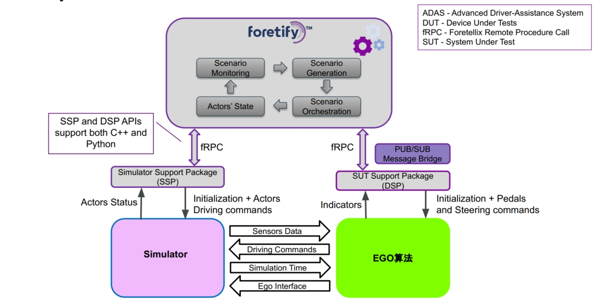
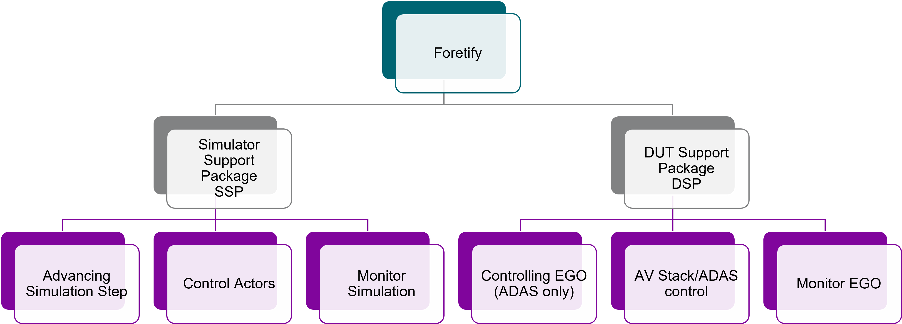
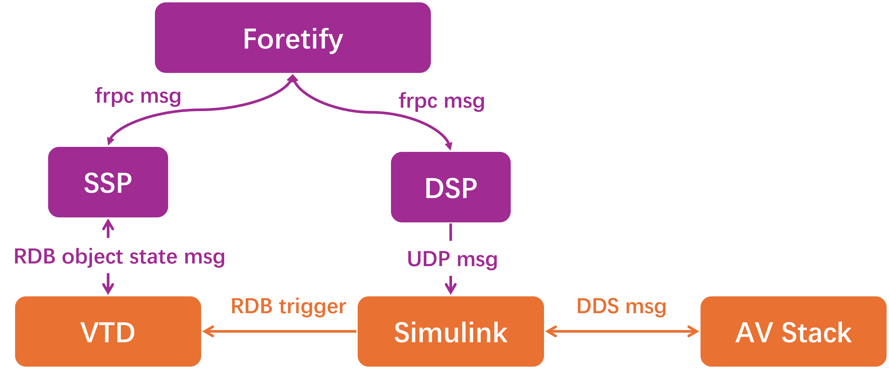

# 集成说明

## 集成的作用

- 为了仿真测试以及评估SUT，Foretify需要设置并编排场景
- 在运行场景时，Foretify会向仿真器和SUT发送大量请求，主要用于:
  - 编排场景
  - 设置NPC和SUT的状态
  - 收集各种状态和指标

## 相关概念 - SSP和DSP组件

Foretify 旨在尽可能保持通用性，以支持多种仿真器和被测系统（SUT）的配置。为了实现这一通用性，Foretellix定义了一套接口：

- **模拟器支持包 SSP** (Simulator Support Package): 
  - SSP是模拟器API的适配组件，提供接口给Foretify，接收Foretify的请求转化成对模拟器API的调用
  
- **被测系统支持包 DSP** (SUT Support Package):
  - DSP是SUT API的适配组件，提供接口给Foretify，接收Foretify的请求转化成对SUT API的调用

SSP 和 DSP 实现了适配器设计模式, 解耦了Foretify核心代码和集成代码, 使其更具通用性。

!!! note "注意"
    - **SSP（标准组件）**由 Foretellix 提供，旨在适配各种模拟器。如果用户使用自研的模拟器，Foretellix 工程师将负责进行定制开发。
    - **DSP（半定制组件）**需根据用户提供的算法接口进行一定程度的定制开发。Foretellix 工程师将协助完成这部分工作。如用户希望自行集成新的算法，Foretellix 工程师将提供标准规范及培训，帮助用户工程师顺利完成算法集成。

## Foretify集成的一般架构

<figure markdown="span">
  { width="600" }
  <figcaption>Foretify集成架构</figcaption>
</figure>

!!! note "注意"
    此图展现的是Foretify集成的一般架构。根据用户SUT算法的实际部署情况，上述架构会有相应调整。

其中各组件之间的关系抽象如下所示：

<figure markdown="span">
  { width="600" }
  <figcaption>Foretify集成的组件关系</figcaption>
</figure>

## 集成架构举例

### 集成案例#1

=== "原有测试架构（Foretify集成前）"

    <figure markdown="span">
      { width="600" }
      <figcaption>Foretify集成前用户setup</figcaption>
    </figure>

=== "Foretify集成后测试架构"

    <figure markdown="span">
      { width="600" }
      <figcaption>Foretify集成后setup</figcaption>
    </figure>

