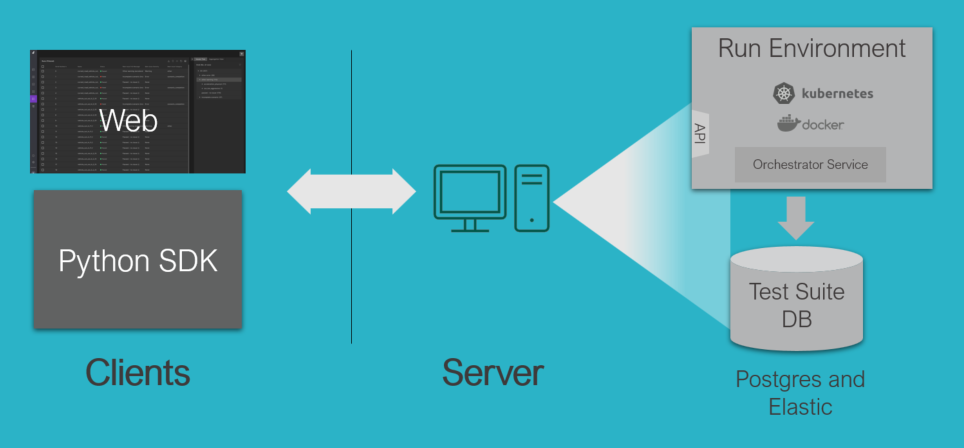
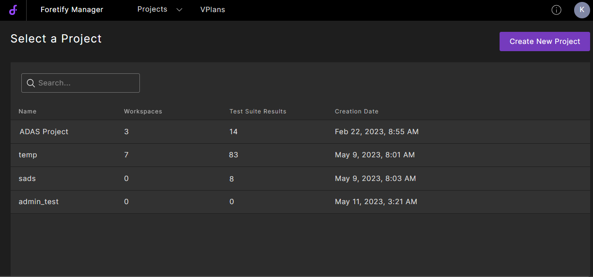
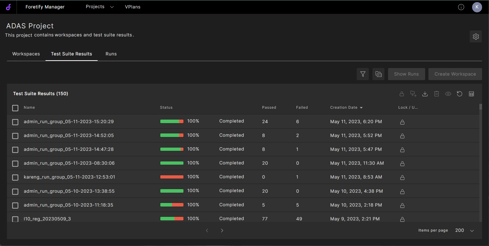
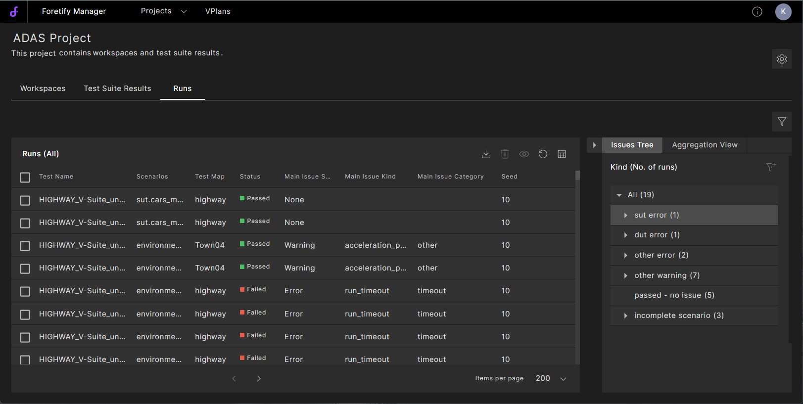
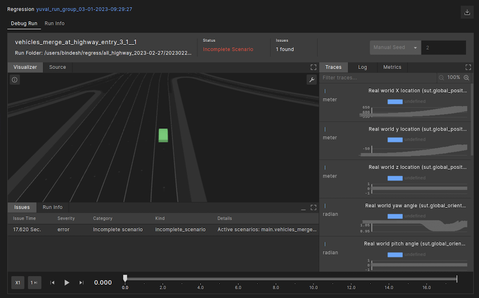
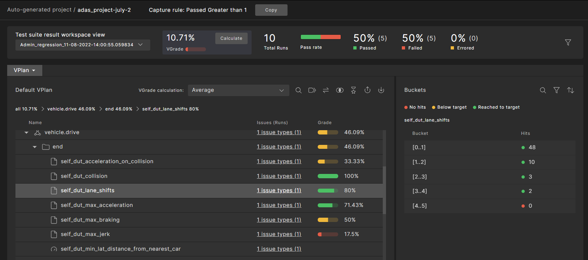
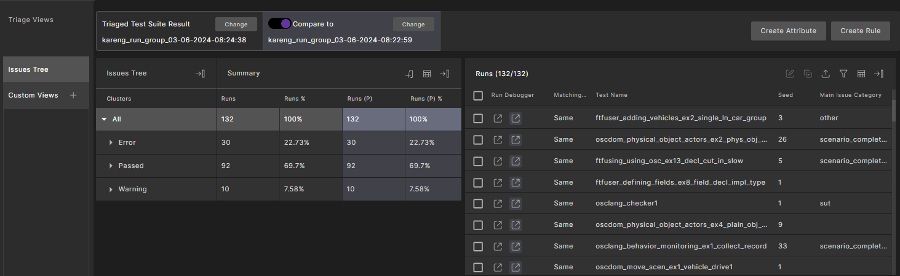
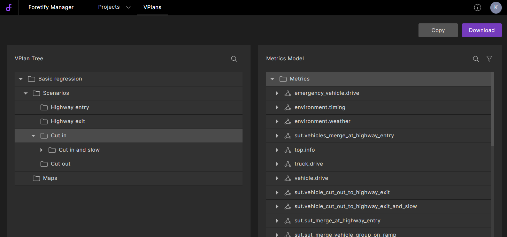
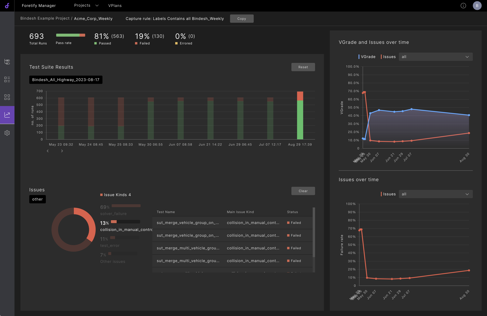

# Foretify Manager 介绍

Foretellix的测试和验证（V&V）环境与V-Suites库一起使用，帮助您验证高级驾驶辅助系统（ADAS）或自动驾驶（AD）功能的安全性。

Foretify Manager是V&V环境的主要引擎之一，在V&V自动化流程的测试组执行和结果分析阶段提供关键功能。

如下图所示，Foretify Manager是一个**基于Web的应用程序**，具有**客户端-服务器架构**。Foretify Manager将上传的测试组结果存储在PostgreSQL和Elasticsearch数据库中，提供对各种存储资产的访问，如共享库、规范和需求，并支持包括用于上传数据的Python客户端和基于Web的UI客户端在内的各种客户端。

<figure markdown="span">
  { width="600" }
  <figcaption>fmanuser_client_server_run_environment</figcaption>
</figure>

本主题简要概述了您可以使用Foretify Manager执行的验证任务。

## 访问Foretify Manager

要访问Foretify Manager：

1. 打开Chrome浏览器。
2. 在URL字段中，输入Foretify Manager的主机名和端口，格式为：`<ip-address>:<port>`。例如：

    ```
    localhost:8080
    ```
    如果您按照[Foretify Manager安装](../setup/foretify_manager_installation.md#安装步骤)设置了`alias fmanager`,则也可以通过该alias进行快速启动。
    ```
    fmanager
    ```   
    
3. 使用您的用户凭据登录到Foretify Manager。

    ??? note "默认账号"
        admin@fmanager/admin

    在Foretify Manager中开始工作之前，您需要选择或创建一个项目。

4. 单击**Projects**下拉列表，选择您的工作项目。或者，您可以单击**Create New Project**创建一个项目。


## 任务流程

典型的Foretify Manager任务流程如下：

### 创建一个项目

一个 Foretify Manager 的**Projects**是一个中心，您的团队可以在其中协作进行V&V项目。您可以创建一个新项目，或者项目的所有者可以将您添加到他们的项目中，赋予您查看、编辑或拥有该项目的权限。在一个项目中，您可以执行下面描述的任务，例如执行一个测试组、分析运行问题以及创建一个工作空间**workspace**。


<figure markdown="span">
  { width="800" }
  <figcaption>fmanuser_select_project</figcaption>
</figure>


### 执行测试组

您可以通过提交包含以下内容的测试组配置，在 Foretify Manager 中启动一个测试组：

- 一组*运行表*，配置您想要执行的测试。
- 识别执行平台等环境设置。

然后，Foretify Manager 调用 Dispatcher 将作业提交给 Foretify，以便它们在多个网络节点上同时执行。

要访问您的测试组，请登录 Foretify Manager，选择或创建一个项目，然后选择**Test Suite Results**选项卡。可访问的测试组执行将显示出来。

<figure markdown="span">
  { width="800" }
  <figcaption>测试组结果选项卡</figcaption>
</figure>


您可以重新启动之前定义的测试组，或定义并启动一个新的。您还可以选择一个或多个测试组，然后展示运行结果或创建工作空间。

!!! tip "如何将测试结果上传至Foretify Manager？"
      - 如果您按照该步骤执行测试组(该方式限于Foreitfy Manager的分布式部署)，则数据会自动保存在Foretify Manager的数据库中；
      - 如您通过Foretify Developer或`frun`指令执行的测试组，则需要工程师通过`upload_runs`指令将测试结果上传至Foretify Manager。具体操作会在正式workshop培训中进行介绍。

## 分析运行问题

Foretify Manager 可帮助您快速识别测试组中的常见问题。一旦您在**Test Suite Results**选项卡中选择一个测试组结果，**Runs**选项卡将会打开，显示一个列出所选测试组中所有运行结果的表格。

<figure markdown="span">
  { width="800" }
  <figcaption>运行选项卡</figcaption>
</figure>

表格右侧的**Issues Tree**显示了按类别排序的所选测试组执行期间发生的问题的分层列表，例如**SUT error**,**Other error**,**SUT warning**等。当然用户可以自定义评价标准及问题类型。

如果您点击表格中列出的一个运行，**Debug run**调试运行窗口会打开，在**Visualizer**中显示所选运行的场景回放，同时还会显示其他运行信息，如**trace**和**metric**。

<figure markdown="span">
  { width="800" }
  <figcaption>调试运行窗口</figcaption>
</figure>


## 创建工作空间

一旦您多次执行了一个测试组并调试到满意的程度，您可以创建一个工作空间 **Workspace**。**Workspace**是用于分析所选测试组执行期间的运行问题和指标的共享空间。

您可以通过转到项目中的**Workspaces**选项卡并单击**Create New Workspace**来创建工作区。然后，您可以配置一个捕获规则来指定要将哪些测试组结果添加到工作区中。您也可以显式地添加测试组结果。

<figure markdown="span">
  { width="800" }
  <figcaption>工作区窗口</figcaption>
</figure>


测试组指标显示在验证计划（VPlan）的结构中。当您创建工作区时，您可以选择默认的VPlan（测试组中所有运行的聚合指标模型），或为您的项目创建自定义的VPlan。

## 测试组结果分诊

创建了工作区后，您可以使用Triage视图对Foretify运行进行分类，并在更细粒度水平上进一步分析和调试。您可以为运行分配**Attribute**并且可以创建**Triage Rules**，让您根据条件执行操作。从Triage中，您还可以在Visualizer中启动运行回放来调查问题。

<figure markdown="span">
  { width="800" }
  <figcaption>Triage窗口</figcaption>
</figure>


## 创建VPlan

在项目开始阶段，测试组的默认VPlan可能足以让您对特定测试组的进展有一个总体感觉。

然而，为了将您的分析重点放在对项目最关键的指标和问题上，最好使用VPlan编辑器创建一个定制的VPlan。

<figure markdown="span">
  { width="800" }
  <figcaption>VPlan编辑器</figcaption>
</figure>


您可以在项目开始阶段创建一个层次化的VPlan，并随着项目的发展逐渐填写层次结构中的运行数据。另一种方法是，您可以基于一个测试组创建一个初始的VPlan，甚至只包含几个场景的几次运行，并随着项目的发展逐渐扩展VPlan结构。无论哪种方法，编写VPlan都是一个迭代的过程。


## 分析指标

**Workspace** 窗口的 **VPlan** 选项卡显示了在运行过程中收集的带有指标数据的VPlan。这些收集的指标数据有助于回答两个关键问题：

- 系统测试得有多好？
- 系统在这些测试中表现得有多好？

第一个问题通过覆盖率等级（VGrade）回答，这是在测试过程中遇到的所有情况的多维表示。第二个问题通过关键绩效指标（KPIs）来回答。

整体VGrade是基于指标模型中所有项目的各自等级计算的。颜色红色、黄色和绿色用于指示具有低、中和高等级的实体。下面是 **Workspace** 窗口的 **VPlan** 选项卡。

<figure markdown="span">
  { width="800" }
  <figcaption>Workspace窗口的VPlan选项卡</figcaption>
</figure>

从 **VPlan** 选项卡，您可以执行各种任务，如识别需要更多测试的区域，确定未达预期的 KPI 等。

## 分析结果随时间变化

趋势页面为您提供了测试组中的关键指标概览 - VGrade 和失败率，并展示它们随时间的变化情况。您可以观察按类别和类型分布的场景失败情况，还可以查看发生这些失败的运行情况。

<figure markdown="span">
  { width="800" }
  <figcaption>趋势展示板</figcaption>
</figure>
