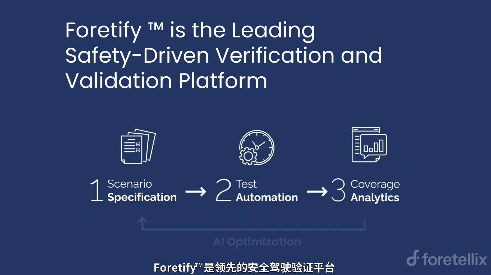
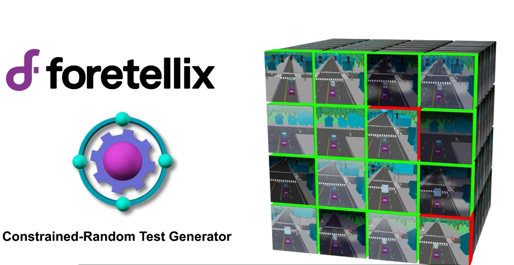
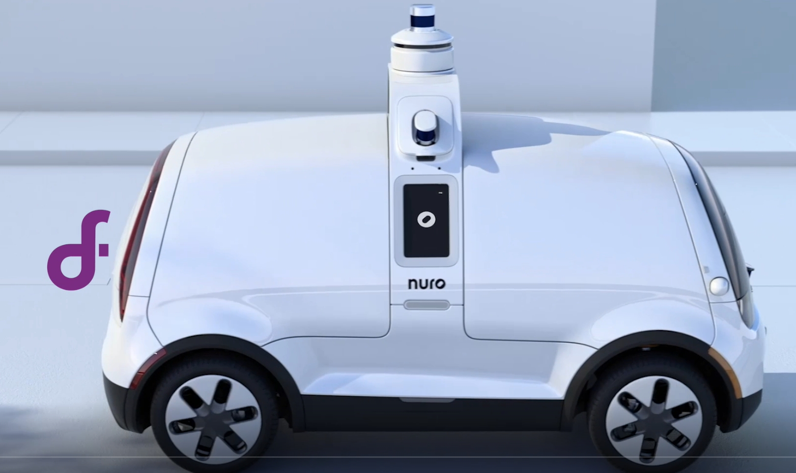
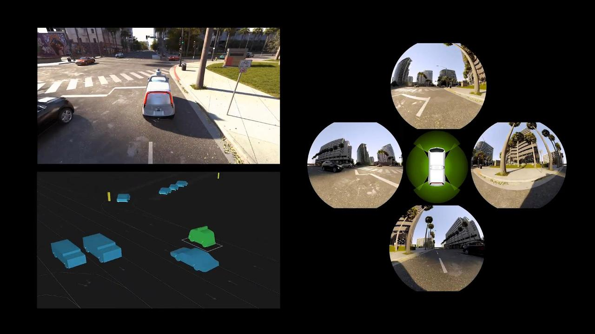

# Foretify - 安全驱动型测试验证平台

Foretify™是由Foretellix公司开发的面向自动驾驶/ADAS的安全驱动型自动化测试和验证平台，其原生支持基于OpenSCENARIO DSL(原OSC 2.0)的抽象场景规范，通过科学的约束随机求解器在虚拟仿真环境中可自动泛化生成大量的驾驶场景并进行指标评价及安全检查，以在开发早期高效地发现边缘案例和错误情况，为衡量覆盖度及系统安全性评估提供依据。

## 为什么需要Foretify?

1. **提升被测系统安全性**
   
      * 通过基于抽象场景的大规模有效泛化，有助于测试或开发工程师在系统开发早期发现系统漏洞、边缘案例或未知风险。

2. **提升研发效率，降低测试成本**
   
      1. 基于少量的抽象场景即可实现成千上万个不同的具体场景的生成，降低场景创建成本及维护成本；
      2. 借助抽象场景的高复用性，可高效创建复杂场景。
      3. 抽象场景定义与地图、泛化方向及仿真平台相解耦，灵活应对不同需求，加速大规模测试部署。
      4. 通过“约束-随机”场景执行核心引擎以智能、自动化和目标导向的方法来生成和分析测试，实现测试节点的大幅左移，缩短上市时间，降低测试成本。
   
3. **助力提升测试完备性，提升测试信心**
   
      1. 通过覆盖度指标评估测试完备性，确认是否在所有预期条件下对自动驾驶车辆进行了测试，并进行后续测试优化以提高测试覆盖度。
      2. 提供虚拟仿真及路测数据分析的一体化平台，促进实现仿真和路测的优势互补。

## Foretify平台的核心组成

Foretify平台的核心组成主要包括以下几个部分：

<figure markdown="span">
  { width="800" }
  <figcaption>Foretify - 安全驱动型测试验证平台</figcaption>
</figure>

1. **Foretify Developer™**: 场景泛化测试开发工具链，原生支持OpenSCENARIO 2.0抽象场景规范，主要用于抽象场景的开发调试。

2. **Foretify Manager™**：V&V场景评价及大数据分析平台，提供关键性能指标(KPI)与测试覆盖度等指标展示以及问题归类分析等功能。

3. **Foretify Core™**：Foretify“约束-随机”场景执行核心引擎，可在虚拟仿真中实现超大规模测试编排及有效生成，内嵌于Foretify平台之中，是约束求解的关键。
   
4. **Foretify V-Suites™**：V&V验证套件，提供面向Level-2 ADAS、Level-3 ALKS和Level-4 Highway的抽象场景库、覆盖项、检查项及KPI等评价指标定义，这些套件中抽象场景是Foretellix在V&V领域逐渐积累下来的高价值抽象场景，该套件也在持续扩充中。

5. **Foretify LogIQ™**：路测数据场景提取及分析工具，支持异常检测、关键场景提取、关键性能指标及覆盖度分析等功能；所提取场景可通过智能回放进行虚拟仿真的泛化测试。

!!! note "注意"
      - Foretify平台并不包含仿真器，而是**支持与各种仿真器的无缝集成**,如VTD，Carmaker, Carla，51Sim等。无论是各大主流仿真平台还是用户自研的仿真器，在提供API接口的情况下Foretify都可与之集成并实现基于抽象场景的泛化测试。
      - Foretify与仿真器的集成**无需仿真器支持OpenScenario DSL（OSC2.0)**

## 基于Foretify平台的仿真验证流程

[Watch Video on Bilibili](https://www.bilibili.com/video/BV1oh8ge4E7M/?vd_source=4207f93b159b5ac403fae18e1d8cf2c4){ .md-button .md-button--primary }

<figure markdown="span">
  { width="500" }
  <figcaption>Foretellix: Road to Safety</figcaption>
</figure>

## 揭秘Foretfiy "约束-随机"测试生成器

随着Foretify新版的发布，全新的“约束-随机”测试生成技术使Foretify性能提升了至少10倍，成为汽车行业最高效的测试生成、执行和管理解决方案。本视频聚焦于Foretify的核心技术，向您介绍Foretify如何基于OSC2.0抽象场景实现高效且有意义的场景泛化。

[Watch Video on Bilibili](https://www.bilibili.com/video/BV1jm8zeuEND/?spm_id_from=333.999.0.0&vd_source=4207f93b159b5ac403fae18e1d8cf2c4){ .md-button .md-button--primary }

<figure markdown="span">
  { width="500" }
  <figcaption>Foretfify "约束-随机"测试生成器</figcaption>
</figure>

## 用户合作案例分享

### Nuro

**Foretellix和Nuro达成战略合作，加速自动驾驶汽车的安全部署**

[Watch Video on Bilibili](https://www.bilibili.com/video/BV1jm8zeuEND/?spm_id_from=333.999.0.0&vd_source=4207f93b159b5ac403fae18e1d8cf2c4){ .md-button .md-button--primary }

<figure markdown="span">
  { width="500" }
  <figcaption>Nuro partership</figcaption>
</figure>

自动驾驶配送初创企业Nuro与Foretellix宣布达成战略合作伙伴关系，以加速自动驾驶车辆在最后一公里配送中的安全和大规模部署，同时实现降本增效。此次合作旨在简化开发过程，降低研发成本，并提高自动驾驶技术的质量和安全性。
Nuro的系统工程主管Sreeja Roy Singh说： “Nuro非常重视安全。Foretellix的安全驱动的V＆V技术支持了Nuro实现安全承诺，同时加速了我们的开发和商业化的道路。”， “Foretellix在使用OpenSCENARIO 2.0进行抽象场景描述和测试自动化方面的领导地位将在Nuro的开发过程中发挥至关重要的作用。它使我们能够使我们的研发更加高效，同时确保我们的技术在现实世界的情境中安全运行”。

Nuro成立于2016年，是一家领先的自动驾驶科技公司，其车辆已在加利福尼亚和德克萨斯州的道路上运行。该公司的核心技术Nuro Driver™是 一个集成的自动驾驶系统，采用了先进的人工智能软件和定制的感知与计算硬件。与Uber和FedEx等合作伙伴关系的建立，使 Nuro 成为自动驾驶技术在无人配送商业领域实际应用的领先者。

### NVIDIA

Foretellix和NVIDIA联合推出ADAS/AV测试解决方案

[Watch Video on Bilibili](https://www.bilibili.com/video/BV1Le8gexEmP/?spm_id_from=333.999.0.0&vd_source=4207f93b159b5ac403fae18e1d8cf2c4){ .md-button .md-button--primary }

<figure markdown="span">
  { width="500" }
  <figcaption>NVIDIA partership</figcaption>
</figure>

确保自动驾驶车辆（AV）的安全性和可靠性，同时加速市场推出时间并控制开发成本至关重要。为了解决这些挑战，Foretellix将NVIDIA Omniverse Cloud API整合到Foretify™平台上，以实现高保真度的传感器模拟。这个新解决方案通过提供基于物理的、高保真度的端到端模拟，以规模化的方式，彻底改变了AV的训练和验证方式。通过高保真度传感器模拟的方式，成功简化了自动驾驶训练和验证过程，并实现了复杂场景的自动化创建与分析。
