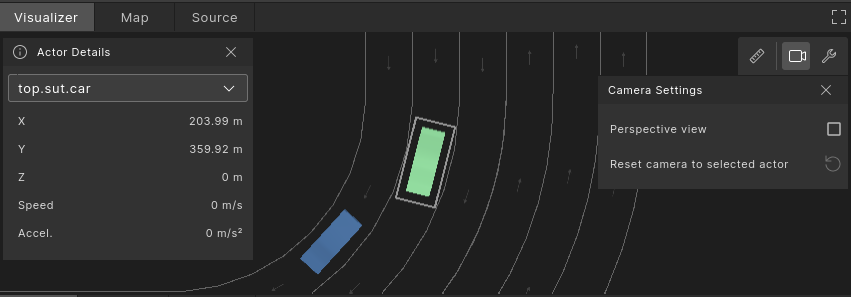
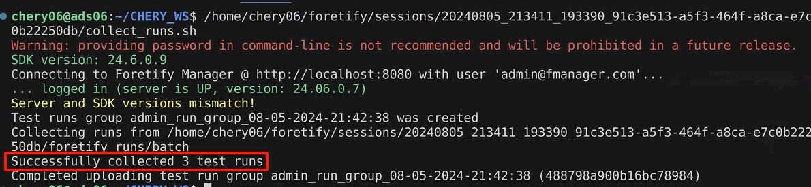

# 快速开始

!!! info "Quick Start"
    
    本节内容旨在帮助用户熟悉foretify环境以及基本的操作流程，主要涉及三方面内容：

    - 用户资产交付情况（抽象场景、测试定义等）
    - 通过Foretify Developer进行场景加载及运行
    - 通过Foretify Manager进行数据查看及分析

## 资产交付及变量配置

**1. 资产交付**

根据当前项目定义的资产包括如下内容，部署在`$HOME/CHERY_WS`路径下。
> *注：截至2024/08/05,资产仍在测试优化中。*

```py title="资产文件结构"
~/CHERY_WS
├── config      # OSC2.0中实现算法启动的功能定义
├── maps        # opendrive 地图（包含`xodr`和同名`opt.osgb`两种文件）
├── scenarios   # OSC2.0 抽象场景
├── ssp_dsp     # DSP相关配置文件
├── test_suites # 测试组定义文件
└── tests       # 测试用例文件

```

**2. 环境变量配置**

为方便起见，请设置`CHERY_WS`的环境变量指向该路径。
>注：该环境变量在交付的资产中有所引用。

```bash title="打开~/.bashrc"
gedit ~/.bashrc
```

```bash title="添加CHERY_WS环境变量"
export CHERY_WS=~/CHERY_WS
```

保存后开启新Terminal确保变量生效。

执行如下命令可以直接通过VScode进入资产目录：

```bash
code $CHERY_WS
```

??? tip "进入资产目录"
    
    <figure markdown="span">
    { width="600" }
    <figcaption> vscode 打开资产目录</figcaption>
    </figure>    


## 测试启动流程

集成后，**Foretify作为测试启动的主入口**，在每次测试过程中会负责实现VTD、Simulink以及被测算法的开启和关闭。
但在运行Foretify之前，需通过脚本`run_sl_mdl.sh`启动matlab。

如下所示为启动测试(STEP 1 & 2)以及上传测试数据（STEP 3）的流程图：

<figure markdown="span">
{ width="600" }
<figcaption> 测试启动流程 </figcaption>
</figure>   

接下来，我们按照该流程启动测试。

## 快速开始

### Step 1. 启动Matlab

```bash title="执行run_sl_mdl.sh"
cd ~/H-NOP/Lon
./run_sl_mdl.sh
```
> 稍等片刻，启动成功后，会出现matlab和simulink两个窗口。请注意matlab**当前的工作目录**应为`~/H-NOP/Lon`，如果为其他路径，请手动更正。

<figure markdown="span">
{ width="600" }
<figcaption> Step1. 启动Matlab </figcaption>
</figure> 


### Step 2. 启动foretify运行测试

#### 1. 进入资产目录

以下两种方式均可：

=== "VSCode"

    ```bash
    code $CHERY_WS
    ```

    VSCode中支持内置终端，可通过VSCode菜单栏中的`Terminal`->`New Terminal`打开一个内置终端：

    <figure markdown="span">
      { width="800" }
      <figcaption>VScode进入资产目录</figcaption>
    </figure>

=== "系统Terminal"

    ```bash
    cd $CHERY_WS
    ```

    <figure markdown="span">
    { width="600" }
    <figcaption>通过系统Terminal进入资产目录</figcaption>
    </figure>


#### 2. 启动foretify加载测试

??? info "测试用例文件"
    所谓的测试（test）或测试用例是一个OSC2.0文件（.OSC），是foretify可直接加载并运行的最顶层文件，主要包含：

    - 抽象场景的导入及调用
    - OpenDRIVE地图配置
    - 仿真器配置
    - 被测对象配置
    - 观测指标定义（覆盖项、评价指标、KPI等）
    
    <figure markdown="span">
    { width="600" }
    <figcaption>典型测试用例文件的组成</figcaption>
    </figure>    


测试定义文件位于`$CHERY_WS/tests`下，我们在terminal用通过`foretify --gui --load <test.osc>`指令用foretify developer加载一项测试用例文件`t_Chery_lead_vehicle_and_slow.osc`：

输入如下指令启动foretify并加载测试用例文件：
> 此处以VScode内置Terminal为例。

```bash title="启动foretify加载测试文件"
cd tests
foretify --gui --load t_Chery_lead_vehicle_and_slow.osc
```

<figure markdown="span">
    { width="800" }
    <figcaption>启动foretify加载测试</figcaption>
</figure>


回车后稍等片刻，您将看到浏览器自动打开foretify developer窗口并加载测试文件：

<figure markdown="span">
    { width="800" }
    <figcaption>foretify加载测试</figcaption>
</figure>

等待加载完成。注意foretify developer界面上方的status变化。


#### 3. 运行测试

点击界面右上角的"Run Test"启动测试。

<figure markdown="span">
    { width="500" }
</figure>

你会看到VTD窗口自动打开并进行仿真。
> 注：foretify在该测试运行前已自动开启了被测算法以及所需的simulink模型。

片刻后，VTD窗口将自动关闭，本次测试完成。注意Status可能会显示为<span style="color: green;">Completed</span>, <span style="color: red;">incomplete scenario</span>, 或<span style="color: red;">SUT error</span>或<span style="color: red;">Test error</span>。
> 注：foretify在该测试运行结束后会自动停止被测算法以及所需的simulink模型。

!!! info "关于测试运行后的status"
    Status表示当前测试运行的状态，如果测试通过，则显示为Completed. 如果测试失败，根据不同的具体原因可显示为incomplete scenario, SUT error或Test error等。具体含义会在正式的workshop培训中进行讲解。


#### 4. 测试调试【可选】

测试完成后，您可以通过Foretify Developer UI上的各项功能进行测试回放、log查询等各种调试操作。

请点击如下Tab分别了解Foretify Developer提供的各种调试工具的使用方法:

=== "Visualizer可视化回放工具"

    Visualizer是一种图形后处理工具，可以以各种方式配置，帮助您分析执行过程。可视化运行不同于重复执行，它不需要模拟器，并且不会消耗重新运行所需的计算资源。一旦执行完成，**Visualizer**选项卡将在屏幕左侧自动打开。您随时都可以单击该选项卡返回到Visualizer。 
    > 单击鼠标右键并将光标拖动到不同的方向来**更改视角**。


    <figure markdown="span">
        { width="400" }
    </figure>


    您可以按下位于左下角Visualizer时间轴上的播放按钮来观看场景是如何重现的：

    <figure markdown="span">
        { width="400" }
    </figure>


    在Visualizer界面还提供了一些小工具：

    === "视图工具"

        您可以通过单击Visualizer右上角的扳手图标来访问**视图工具**。**视图工具**提供了控制视图的选项：

        <figure markdown="span">
            { width="800" }
        </figure>

        - **Lane directions**：启用或禁用驾驶方向箭头的显示。
        - **Signals**：切换交通信号的可见性。
        - **Speed limits**：显示道路的限速。
        - **Collision avoidance**：启用碰撞避免激活的可见性。
        - **Runtime trajectories**：显示所选车辆角色的轨迹。
        - **Planned path**：突出显示场景中车辆的路径。
        - **Planned objectives**：显示为所选车辆角色生成的计划目标。
        - **Planned pose**：突出显示系统正在测试的车辆和其他车辆的下一个姿态。
        - **Driver obejectives**：显示为所选车辆角色生成的驾驶目标。
        - **Projected pose**：显示车辆的预测位置。

    === "视角设置"

        要控制视角和摄像头，请单击摄像头设置（相机）图标。要使用摄像头跟踪特定的角色，请从左上角的下拉列表中选择一个角色，或者在Visualizer中单击以将摄像头设置为固定位置。

        <figure markdown="span">
            { width="800" }
        </figure>

        - **Perspective view**：透视视图，取消勾选可将视角改为俯视图。
        - **Follow selected actor**：跟踪所选的角色。
        - **Reset camera to selected actor**：将摄像头重置为所选角色的位置。
  
    === "测距工具"

        === "Step 1. 设置俯视图"

            使用"测距工具"之前，请先将视角切换到俯视图（取消勾选Perspective view）状态下，右上角选择“相机设置”图标。

            <figure markdown="span">
                { width="800" }
            </figure>

        === "Step 2. 选择测量工具"

            选择“测量距离”工具图标。

            <figure markdown="span">
                { width="800" }
            </figure>    


        === "Step 3. 开始测量"

            在Visualizer中点击以设置测量的起始点，然后移动光标并点击以设置测量的结束点。

            <figure markdown="span">
                { width="800" }
            </figure>    

            测量结果将显示在连接起始点和结束点的线旁边。
            >要隐藏测量结果，请切换关闭“测量距离”工具图标。

=== "Traces视图"

    所有信号可以在**Traces视图**下查看。Traces视图与时间轴对齐，因此您可以轻松比较不同的Traces。

    **Traces** 表示为以下不同类型：

    - **Interval阶段**：场景阶段的可视化表示（橙色方框）：阶段有名称、开始/结束时间和类型，并且与特定参与者相关联。
      > Foretif自动记录每个场景的开始和结束时间。

    - **Values数值**：代表随时间变化的单个数值，数值以波形图形式显示（红色方框），数值Traces有名称、数值和单位，并且与特定参与者相关联。

    <figure markdown="span">
        { width="800" }
    </figure>    


    === "查看阶段Interval"

        点击**Visualizer**下的**Traces**选项卡：

        <figure markdown="span">
            { width="800" }
        </figure>  

        在时间轴中，Traces显示为阶段，当前时间光标对应于其他基于时间的视图，如Visualizer和Traces选项卡中的Actor值Traces。

        1. 单击Traces名称左侧的箭头以展开它，并查看其子场景。
        2. 单击Traces以查看Traces详细信息，例如Traces类型、Actor、时间、持续时间以及阶段期间收集的度量标准。
        3. 在Traces详细信息下，单击Traces的开始时间或结束时间以将通用时间轴设置为该时间。

    === "查看指定阶段"

        在Traces选项卡上，选择要将时间轴定位到的阶段（橙色框）。
        单击"**Frame Timeline**"图标（红色框）。

        <figure markdown="span">
            { width="800" }
        </figure>  

        要重置时间轴，使其不再框定所选阶段，请单击时间轴右侧的取消框架时间轴图标（**Reset Frame**）。


---


#### 5. 更换Seed多次测试

!!!info "关于Seed（种子）"
    **种子（seed）** 是 Foretify 在每次执行具体测试时生成的一个输入，取值为**任意正整数**。种子可以看作**每个具体场景的唯一标识**。使用相同的种子，可以从抽象定义中再次生成相同的具体测试场景。这一功能非常关键，因为它**既可以实现测试的完全随机化**，**又可以为调试目的重新创建特定的测试执行，确保场景测试的可追溯性**。


接下来尝试更换几个不同的`Seed`运行多次测试，可选择两种不同的方式：

=== "手动运行"

    您可以选择手动依次设置不同的"seed"(Foretify Developer UI右上方), 然后点击右上角的"Run Test"运行测试。

=== "自动连续运行"
    
    通过`crun <num>`指令实现连续运行，后面的数字`<num>`代表运行次数，连续运行过程中seed自动增加。比如如果当前`seed`为1，则`crun 5`会得到seed从1~5共5次不同的run。


    === "Foretify内置Terminal"
        您可以点击打开Foretify UI右上角的内置"Terminal终端"，然后在Terminal中输入：

        ```bash
        crun 5
        ```
        <figure markdown="span">
            { width="600" }
        </figure>            

    === "非-Foretify Terminal"
        
        如果希望在启动foretify时自动执行连续测试，也可以直接在调用foretify时在Terminal中输入：

        ```bash
        foretify --crun 5 --load $CHERY_WS/tests/t_Chery_lead_vehicle_and_slow.osc --work_dir ~/cruntest 
        ```
        >选项`--work_dir`用于设置测试数据存储目录。运行结束后，测试运行的结果数据会自动保存在所设置的`~/cruntest`目录下。


运行结束后，您可以通过在Foretify终端中键入“exit”或关闭Foretify窗口来关闭Foretify，或在启动foretify的Terminal中`Ctrl+C`。

---

#### 6. 自动批量测试

!!!info "frun自动化工具"

    Foretellix提供自动化测试脚本`frun`可实现批量测试自动化，同时可任意设置泛化次数、所用地图、场景及场景泛化参数、甚至仿真器等。
    > 本快速开始指南仅介绍最基本的`frun`使用方式。更多`frun`功能请解锁正式Workshop培训。

frun可接收由csv定义的测试组，其中可指定需要执行的测试文件，测试次数、起始seed等。

**:fontawesome-solid-laptop-code: 用vscode打开`$CHERY_WS/tests`，并点击点击`batch_tests.csv`进行查看。**

```bash
code $CHERY_WS/tests
```

<figure markdown="span">
    { width="800" }
</figure>   

如上图所示，该csv中定义了需要依次执行的若干测试文件(test)及所需执行的测试次数（runs）和起始种子（seed）。

??? tip "tip - VScode中查看csv文件"
    可为VScode安装"Edit CSV"插件，方便CSV文件在VScode中的查看。

    <figure markdown="span">
        { width="400" }
    </figure> 

    安装成功后，在VScode中选中csv文件后，点击右上角的"Edit csv"即可。

    <figure markdown="span">
        { width="400" }
    </figure>    


**:fontawesome-solid-laptop-code: 启动frun**：

```bash title="启动frun，执行自动化测试"
cd $CHERY_WS/tests
frun --csv batch_tests.csv --batch --info
```

<figure markdown="span">
    { width="800" }
</figure>   

同时，在Terminal中应会看到类似如下输出：

<figure markdown="span">
    { width="800" }
</figure>   

随后，你会注意到VTD窗口会自动启停，顺次执行自动化测试。

自动化测试执行完毕后，会自动将数据记录保存至默认目录下`~/foretfiy`。
> 用户也可通过`frun --work_dir <自定义目录>`设置其他自定义目录。


### Step 3. 上传数据至Fmanager进行统计分析

**1. 上传数据至Fmanager**

在frun批量自动化测试执行完成后，在Terminal窗口中将会看到如下一行输出：`To collect runs in fmanager issue the following command: xxxx.sh`. 该指令是**用于快速上传该次frun自动化测试结果**的脚本。

<figure markdown="span">
    { width="800" }
</figure>   

将该指令复制到新的Terminal中，回车。稍等片刻后，会看到该批次测试数据上传成功。
> frun指令默认将数据上传至`admin`名下的`admin`project下。如果该`admin`项目不存在则会提示报错。因此需要提前创建项目。

<figure markdown="span">
    { width="800" }
</figure>  


**2. 打开Fmanager进行数据分析查看**

在Terminal中输入`fmanager`启动fmanager页面并登录。

??? tip "登录账号"
    * username: admin@fmanager.com
    * password: admin

**查看上传的测试组**

最新上传的数据结果会出现在对应Project下的测试组结果（Test Suite Results）下:

<figure markdown="span">
    { width="800" }
</figure>  

通过点击最新导入的测试组，你可以查看各个测试运行的结果。

你应该看到类似下图所示的内容：

<figure markdown="span">
    { width="800" }
</figure>  


彩色方块标注了：

- _黄色_: 运行列表右上角的图标让你能够导出和删除运行，以及保留和重置你的选择。使用最右侧的列选择图标添加和移除运行属性，比如目录、操作系统用户、持续时间等。
- _橙色_: _问题树_ 按其类型将所有问题分组呈现。
- _蓝色_: _汇总视图_ 让您能够基于运行属性对运行进行汇总。

当点击 _Runs_ 视图中的一个运行时，会出现一个新的 Foretify Manager 窗口。

<figure markdown="span">
    { width="800" }
</figure>  


正如你所见，在这里有两个主要选项卡：**Debug Run 调试运行** 和 **Run Summary 运行摘要**。 
**Debug Run 调试运行** 选项卡与我们之前在 Foretify 中看到过的一样:

<figure markdown="span">
    { width="800" }
</figure>  


单击 **Run Summary** 选项卡，您可以查看有关失败运行案例的更详细信息。  

<figure markdown="span">
    { width="800" }
</figure>  


**创建Workspace以对测试组进行分析**

!!! info "什么是工作区** Workspace**?"
    Foretify Manager 的Workspace是一个共享且持久的工作区，主要用于对测试运行问题进行分析和观测指标的分析评价。

!!! Example "动手实践"
    在**Test Suite Results**选项卡中选择您的测试组，然后按如下所示单击**Create Workspace**。

    <figure markdown="span">
        { width="800" }
    </figure>  

    自定义一个工作区名称，然后单击**Create Workspace**以创建该工作区。

    <figure markdown="span">
        { width="800" }
    </figure>  

    创建成功后，Foretify Manager Web 应用程序会自动切换到 **当前工作区** 视图：

    <figure markdown="span">
        { width="800" }
    </figure>  


工作区包含以下内容：

- **VGrade**：总体覆盖度等级，用于衡量总体测试覆盖的水平。
- **Total Runs（VGrade 旁边）** 通过和失败运行案例的统计数据。
- 在 **VPlan** 选项卡（蓝色）中，您可以看到度量标准层次结构。
  > 默认的`vPlan`会包含很多冗余信息，后续的课程中我们会学习如何创建目的明确的vplan。
- 在 **Runs** 选项卡（绿色）中，可以看到当前工作区所选的运行列表。

!!! note "了解更多"
    至此，您已经了解了foretify的基本操作流程：从加载测试->运行测试->批量自动测试->fmanager查看数据及统计分析。
    至于更多功能详情及OSC2.0的相关知识，建议通过正式的Workshop培训系统学习。

