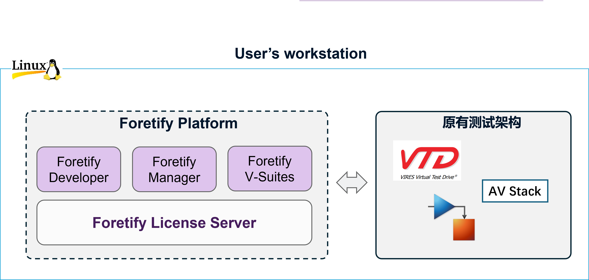

# 软件的安装及部署

用户如果使用本地的单台工作站进行测试，则Foretify的相关软件及License服务器也可部署在该机器上。需要安装部署的组件包括：

- Foretify License Server: 用于提供license服务
- Foretify平台：
  - Foretify Developer
  - Foretify Manager

以上组件需按顺序依次安装。

<figure markdown="span">
  { width="600" }
  <figcaption>Foretify软件安装及部署</figcaption>
</figure>

!!! note "注意"
    Foretify V-Suites随Foretify Developer一并安装

### 硬件及系统需求

#### 系统及软件需求

| Product | Prerequisites | Platform support |
|---|---|---|
| Foretify |  | Ubuntu 20.04 and 22.04. |
| Foretify UI Client | | Google Chrome Version 113 and above. |
| Foretify Manager Server | <ul><li>Elasticsearch 8.6 or newer is required from the 23.04 release onwards. </li><li>PostgreSQL 9.6 or newer is supported (tested up to PostgreSQL 12).</li></ul> | Ubuntu 20.04 and 22.04. |
| Foretify Manager Python SDK Client | Python 3.7 | Ubuntu 20.04 and 22.04. |
| Foretify Manager UI Client | | Google Chrome Version 113 and above. |

!!! note "注意"
    本指南中推荐使用Docker安装Foretify Manager Server，所需包含的组件均已包含在Docker内。

#### 硬件需求

| Product | CPU/GPU | Memory |
|---|---|---|
| Foretify |  | 16GB RAM recommended |
| Foretify Manager server | 4 x86 CPU cores (8 recommended) | 32GB RAM recommended for 500k runs. For larger runs and more users, more memory may be required. |
| Foretify UI client | GPU support needed: Using WebGL 2.0 which requires hardware with OpenGL ES 3.0 support or comparable desktop OpenGL feature support  | 16GB RAM recommended |
| Foretify Manager UI client | GPU support needed: Using WebGL 2.0 which requires hardware with OpenGL ES 3.0 support or comparable desktop OpenGL feature support  | 16GB RAM recommended |

