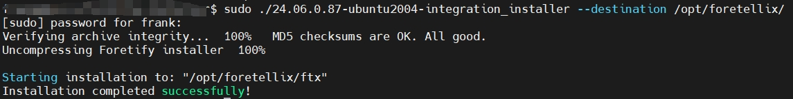
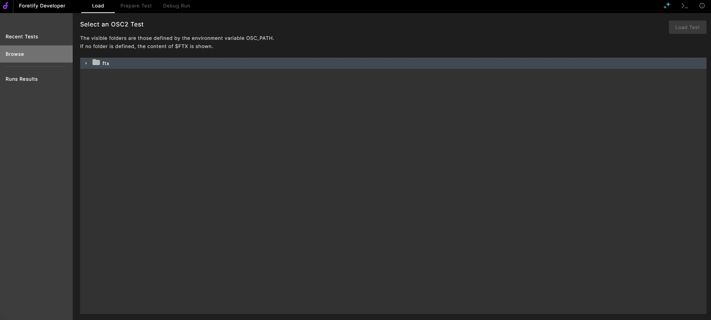

# Foretify 安装

!!! info "关于foretify"
    在本指南中，**foretfiy**指代两部分：

    1. Foretify Core - “约束-随机”测试生成引擎
    2. Foretify Developer - 用于场景调试的Foretify用户界面

## 安装前准备

**1. 安装要求**

   * 一台 Ubuntu 20.04 或更高版本的服务器。
   * 推荐Chrome 浏览器，用于启动Foretify Developer用户界面。
   * 一个[非]root用户，在本指南中称为 **USER**
   * 完成[许可证服务器安装](license_server_installation.md)

**2. 安装文件**

Foretellix工程师会提供如下安装文件：

| 安装文件 | 名称参考 | 
|---|---|
| **Foretify依赖文件** | foretify_prerequisites.tar.xz |
| **Foretify安装包** | 24.06.0.xx-ubuntu2004-integration_installer |

同样假设上述安装文件位于`home`目录下的`FORETELLIX_INSTALL`文件夹内：

```yaml title="文件结构"
~/FORETELLIX_INSTALL/
├── foretify_prerequisites.tar.xz
└── 24.06.0.xx-ubuntu2004-integration_installer
```

## 安装步骤

### 安装环境依赖项

``` py
sudo apt install -y lsb-core ksh tcsh
sudo ln -s /usr/bin/basename /bin/basename
sudo dpkg-reconfigure dash #(choose no **选择 否**)
sudo dpkg --add-architecture i386
sudo apt-get update
sudo apt install -y libx11-6:i386 libncurses5:i386
```

### 安装Foretify依赖文件

**1. 将Foretellix提供的压缩包解压至安装目录：**

``` bash
cd ~/FORETELLIX_INSTALL
sudo tar -xvf foretify_prerequisites.tar.xz -C /opt/foretellix/
```
> 文件较大，需等片刻。解压后会在安装目录下得到一个文件夹`XCELIUM1809`.

**2. 更改Ownership:**

``` bash
sudo chown -R $USER:users /opt/foretellix/XCELIUM1809
```

**3. 在安装目录下新建一个文件`ftx.rc`并添加变量设置**

``` bash
cd /opt/foretellix/
gedit ftx.rc
```

``` py title="添加以下内容至ftx.rc"
export CDS_LIC_FILE=5280@<license_server IP>
export INCISIVE_HOME=/opt/foretellix/XCELIUM1809
export SPECMAN_PATH=${INCISIVE_HOME}/tools/bin
export CDS_INST_DIR=${INCISIVE_HOME}
export CDS_AUTO_64BIT=ALL
export CDS_LIC_QUEUE_POLL=1
export CDS_LIC_QUEUE_POLL_INT=10
export PATH=$PATH:${INCISIVE_HOME}/bin:${INCISIVE_HOME}/tools/bin
```
>注意替换`<license_server IP>`, 如果license安装在本机，可设为 `127.0.0.1`。

通过source `ftx.rc` 文件使环境变量生效：

```
source /opt/foretellix/ftx.rc
```
!!! tip "tip - 添加至~/.bashrc"

    为方便起见，请将上行代码添加至用户的 `~/.bashrc`文件中，这样每次打开新的terminal会自动加载变量配置。

**4. 测试foretify依赖文件是否安装成功：**

在Terminal(确保该Terminal已经进行过上述source操作)中输入`specman`，如果您看到类似如下输出，则可进入下一步。

``` bash
Linked on Mon Sep 17 16:10:52 2018
Protected by U.S. Patents 6,141,630 ;6,182,258; 6,219,809; 6,347,388;
6,487,704; 6,499,132; 6,502,232; 6,519,727; 6,530,054; 6,675,138; 6,684,359;
6,687,662; 6,907,599; 6,918,076; 6,920,583; Other Patents Pending.
Checking license ... OK

```

### 安装Foretify

Foretellix提供的Foretify安装包为一个二进制文件，如`24.06.0.xx-ubuntu2004-integration_installer`, 本指南中称为`<foretify_file>`。


**1. 解压安装包**

执行以下命令，将foretify安装至`/opt/foretellix/`

``` py
cd ~/FORETELLIX_INSTALL
sudo ./<installer_file> --destination /opt/foretellix/
```

<figure markdown="span">
  { width="800" }
  <figcaption>安装 Foretify</figcaption>
</figure>

安装成功后，会在安装目录`/opt/foretellix/`下看到一个叫`ftx`的文件夹，更改其owner：

``` bash
sudo chown -R $USER:users /opt/foretellix/ftx
```

**2. 添加环境变量**

再次打开`/opt/foretellix/ftx.rc`, 添加如下变量设置，并保存。

注意替换`<license_server IP>`, 如果license安装在本机，可设为 `127.0.0.1`。


``` bash
export FTX=/opt/foretellix/ftx
export FTX_LIC_FILE=27001@<license_server IP>
source $FTX/bin/ftx_setup.sh 
```

同样地，为确保上述变量生效，请执行 `source /opt/foretellix/ftx.rc`。如果您已经将该语句添加至 `~/.bashrc`中，则新打开Terminal中，变量设置也会生效。

### 验证安装状态

在Terminal中输入：

``` py
foretify --gui
```

如果您看到浏览器自动打开并显示如下界面，那恭喜您，**foretify安装成功**。

<figure markdown="span">
  { width="600" }
  <figcaption>Foretify Developer UI</figcaption>
</figure>

---

至此，你的安装目录下的文件结构应如下所示：

```yml title="安装目录下的文件结构"
/opt/foretellix/
├── foretellix_licensing_server
├── foretellix_licensing_servers
├── ftx
├── ftx.rc
├── licenses
└── XCELIUM1809

```

