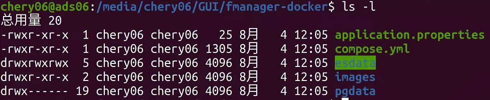
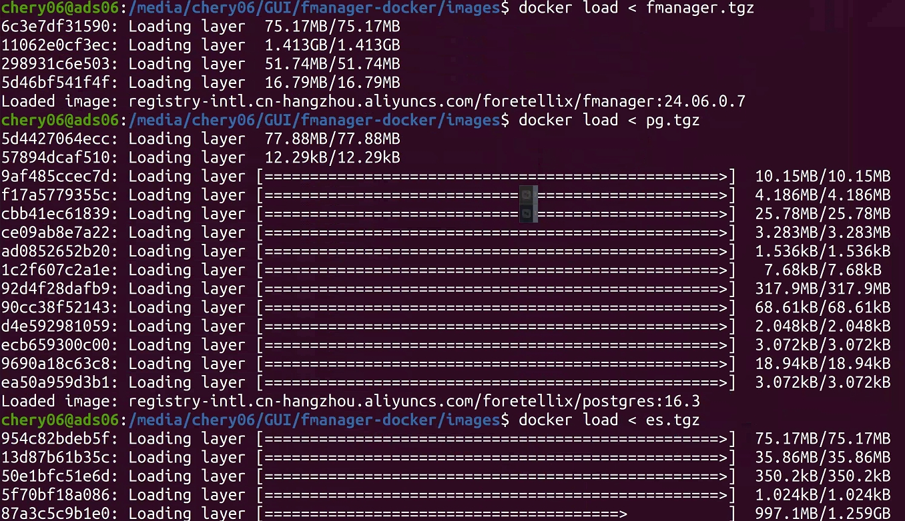
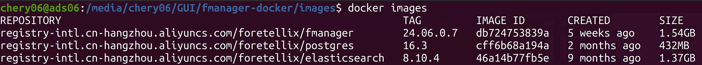
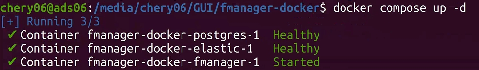
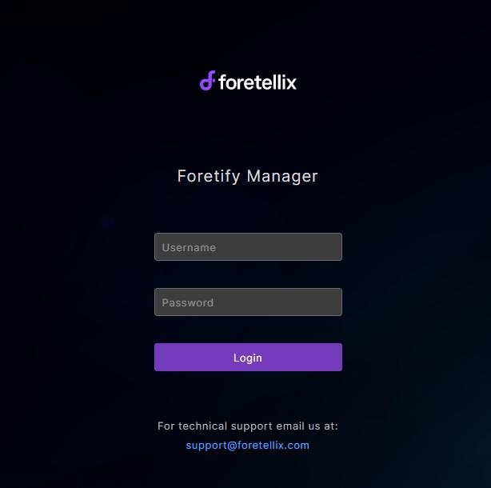

# Foretify Manager安装

!!! info "关于Foretify Manager"
    **Foretify Manager**采用B/S架构，因此安装也分为Server和Client两部分。
    本指南中，为方便起见，将**Foretify Manager**也简称为**fmanager**.


## 安装前准备

**1. 安装要求**

   * 一台 Ubuntu 20.04 或更高版本的服务器。
   * 推荐Chrome 浏览器，用于启动Foretify Manager用户界面。
   * 一个[非]root用户，在本指南中称为 **USER**
   * 完成[许可证服务器安装](license_server_installation.md)

**2. 安装文件**

Foretify Manager 的安装分为两部分：

| 安装文件 | 名称参考 | 说明|
|---|---|---|
| **FManager Server** | fmanager-docker |包含Server所需组件的 Docker 镜像|
| **FManager Client** | fmanager_24.06.0.9_ubuntu2004.tar.gz |提供了与Server通讯的一些必要组件及命令|

同样假设上述安装文件位于`home`目录下的`FORETELLIX_INSTALL`文件夹内：

```yaml title="文件结构"
~/FORETELLIX_INSTALL/
├── fmanager-docker
    ├──application.properties
    ├──compose.yml
    ├──esdata
    ├──images
    ├──pgdata
└── fmanager_24.06.0.9_ubuntu2004.tar.gz
```


## 安装步骤

### 安装docker环境

如已有Docker环境，可跳过此步。

安装步骤可参考[Install Docker Engine on Ubuntu](https://docs.docker.com/engine/install/ubuntu/)）

!!! note "国内安装Docker受限的解决办法"
    如果在安装过程中遇到类似如下的错误提示:
    `Failed to connect to get.docker.com port 443 after 60247 ms: Connection refused`
    可考虑更换国内镜像源进行安装。参考如下代码。

    ```bash title="替换为国内镜像" hl_lines="5 10"
    # Add Docker's official GPG key:
    sudo apt-get update
    sudo apt-get install ca-certificates curl
    sudo install -m 0755 -d /etc/apt/keyrings
    sudo curl -fsSL https://mirrors.ustc.edu.cn/docker-ce/linux/ubuntu/gpg -o /etc/apt/keyrings/docker.asc
    sudo chmod a+r /etc/apt/keyrings/docker.asc

    # Add the repository to Apt sources:
    echo \
    "deb [arch=$(dpkg --print-architecture) signed-by=/etc/apt/keyrings/docker.asc] https://mirrors.ustc.edu.cn/docker-ce/linux/ubuntu \
    $(. /etc/os-release && echo "$VERSION_CODENAME") stable" | \
    sudo tee /etc/apt/sources.list.d/docker.list > /dev/null
    sudo apt-get update

    sudo apt-get install docker-ce docker-ce-cli containerd.io docker-buildx-plugin docker-compose-plugin
    ```
    >安装过程中如遇到弹窗用户交互，选择默认选项即可。

### FManager Server 安装

**1. 将`fmanager-docker`拷贝至目标安装目录**

!!! note "安装目录选择"
    因FManager Server中包含数据库用于保存测试数据，因此推荐选择**容量空间大的硬盘位置**作为fmanager Server的**安装目录**。

``` py
cd <目标安装目录>
sudo cp -r ~/FORETELLIX_INSTALL/fmanager-docker .
sudo chown -R $USER:$USER fmanager-docker
sudo chmod -R 777 fmanager-docker/esdata
```
> **注意**替换<目标安装目录>

上述命令执行后，通过`ll`或`ls -l`指令查看fmanager-docker下的文件应如下所示：

<figure markdown="span">
  { width="800" }
  <figcaption>fmanager-docker</figcaption>
</figure>


**2. 加载Docker镜像**

fmanager-docker中在`images`路径下提供了所需的3个Docker镜像，需要通过`docker load < <image.tgz>`指令进行加载。

```bash
cd <目标安装目录>/fmanager-docker/images
docker load < fmanager.tgz
docker load < pg.tgz
docker load < es.tgz
```

??? info "镜像加载中..."

    <figure markdown="span">
    { width="800" }
    <figcaption>镜像加载中</figcaption>
    </figure>

??? info "`docker images`查看已加载镜像"

    待加载完成后，通过`docker images`可查看3个镜像已成功加载：

    <figure markdown="span">
    { width="800" }
    <figcaption>镜像成功加载完成</figcaption>
    </figure>

**3. 启动Server服务**

进入`<fmanager-docker>/`目录下，通过`docker compose -up d`启动Server服务： 

``` bash
cd <目标安装目录>/fmanager-docker
docker compose up -d
```
> 选项`-d`表示后台运行服务。

如果启动成功，您将看到类似如下输出：

<figure markdown="span">
  { width="600" }
  <figcaption>Foretify Manager Server服务启动成功！</figcaption>
</figure>

!!! note "注意"
    当前Docker模式下的Server服务并不会开启自启动，因此每次**工作站重启后**，需**手动启动该服务**。


### FManager Client 安装

将Client安装包解压至安装目录并更改Ownship：

``` bash title="选择默认安装目录: opt/foretellix/"
sudo tar -xzvf ~/FORETELLIX_INSTALL/fmanager_<VERSION>_ubuntu2004.tar.gz -C /opt/foretellix/
```
> **注意**需替换命令中的`<VERSION>`，以实际提供的client安装包名称为准。

解压后将出现`fmanager_<VERSION>_ubuntu2004`文件夹, 名称如：`fmanager_24.06.0.9_ubuntu2004`,更改其Ownship:

``` bash
sudo chown -R $USER:users /opt/foretellix/fmanager_<VERSION>_ubuntu2004
```
> **注意**需替换命令中的`<VERSION>`，以实际提供的client安装包名称为准。

至此，你的安装目录下的文件结构应如下所示：

??? info "安装目录文件结构"

    ```yml title="安装目录下的文件结构"
    /opt/foretellix/
    ├── fmanager_24.06.0.9_ubuntu2004
    ├── foretellix_licensing_server
    ├── foretellix_licensing_servers
    ├── ftx
    ├── ftx.rc
    ├── licenses
    └── XCELIUM1809
    ```
    >如果Fmanager Server也安装在此，则还应包含`fmanager-docker`文件夹。


### 配置环境变量

再次打开 `/opt/foretellix/ftx.rc`，添加如下环境变量：

``` bash hl_lines="1"
export PATH=$PATH:/opt/foretellix/fmanager_<VERSION>_ubuntu2004/client/bin
export FTX_FM_HOST=localhost
export FTX_FMANAGER_PORT=8080
export FTX_FMANAGER_HOST=localhost
export FMANAGER_USER=admin@fmanager.com
export FMANAGER_PWD=admin
export FTX_FMANAGER_PROJECT=admin
alias fmanager='google-chrome http://${FTX_FMANAGER_HOST}:${FTX_FMANAGER_PORT}'

```
> - 注意替换第1行出现的`<VERSIOIN>`, 保持与实际文件夹名称一致。
> - 最后一行配置了访问fmanager Web UI的alias,如果您希望使用其他浏览器,比如firefox, 可替换为`alias fmanager='firefox ${FTX_FMANAGER_HOST}:${FTX_FMANAGER_PORT} &'`

更新后保存文件。

### 验证Fmanager的安装状态

使用fmanager之前确保`/opt/foretellix/ftx.rc`有被source到。
> 如果您遵循此前的步骤，已将`source /opt/foretellix/ftx.rc`的指令添加至`~/.bashrc`中，则您只需打开一个新的Terminal窗口即可。

打开Terminal,输入：

``` bash title="启动fmanager"
fmanager
```

如果您看到浏览器自动打开并显示如下界面，那恭喜您，Foretify Manager安装成功。

<figure markdown="span">
  { width="600" }
  <figcaption>Foretify Manager Client UI</figcaption>
</figure>


