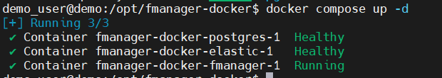
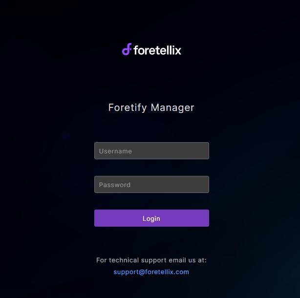

# Foretify Manager安装

Foretify Manager 的安装分为两部分：

1. **Foretify Manager Server**：提供了一个 Dockerfile，使您能够构建一个包含运行 Foretify Manager 所需的所有组件的 Docker 镜像。
为便于安装，Foretellix可提供直接build好的Foretify Manager的Docker镜像文件 `fmanager-docker`；
2. **Foretify Manager Client**：Client中提供了与Server通讯的一些必要组件及脚本命令。Foretellix会提供一个压缩包文件，如`fmanager_24.06.0.9_ubuntu2004.tar.gz`。

## 安装前准备

1. 完成许可证服务器安装
2. **Foretify Manager Server** Docker镜像文件（联系Foretellix工程师提供）
3. **Foretify Manage Client**压缩包文件（联系Foretellix工程师提供）
4. 确保工作站具有Docker环境。（可参考[Install Docker Engine on Ubuntu](https://docs.docker.com/engine/install/ubuntu/)）


## 安装步骤

### Foretify Manager Server 安装

**将Foretify Manager镜像文件拷贝至安装目录**

``` py
sudo cp -r <fmanager-docker镜像文件> /opt/foretellix/
```

**启动Foretify Manager的Docker服务**

进入`<fmanager-docker>` 

``` py
cd /opt/foretellix/<fmanager-docker>
docker compose up -d
```

如果启动成功，您将看到类似如下输出：

<figure markdown="span">
  { width="400" }
  <!-- <figcaption>Foretify Manager Server启动成功</figcaption> -->
</figure>

### Foretify Manager Client 安装

**解压安装包至安装目录**

``` py
tar -xzvf <fmanager安装包.tar.gz> /opt/foretellix/
```

解压后将出现`<fmanager client>`文件夹, 名称如：`fmanager_24.06.0.9_ubuntu2004`。修改其ownership,这样该机器的其他user也有权限对foretify manager中的测试数据进行访问查看。

``` py
sudo chown -R $USER:users /opt/foretellix/<fmanager client>
```

**添加环境变量**

再次打开 `/ftx/foretellix/ftx.rc`，添加如下环境变量：

``` py
export PATH=$PATH:/opt/foretellix/<fmanager client>/client/bin
export FTX_FM_HOST=localhost
export FTX_FMANAGER_PORT=8080
export FTX_FMANAGER_HOST=localhost
export FTX_FMANAGER_PORT=8080
export FMANAGER_USER=admin@fmanager.com
export FMANAGER_PWD=admin
export FTX_FMANAGER_PROJECT=admin
alias fmanager='firefox ${FTX_FMANAGER_HOST}:${FTX_FMANAGER_PORT} &'
```

注意将其中`<fmanager client>`替换成真实文件夹名称。

更新后保存文件。使用foretify manager之前确保`ftx.rc`有被source到。

### 验证安装

打开Terminal,输入：

``` py
fmanager
```

如果您看到浏览器自动打开并显示如下界面，那恭喜您，Foretify Developer安装成功。

<figure markdown="span">
  { width="600" }
  <figcaption>Foretify Manager Client UI</figcaption>
</figure>