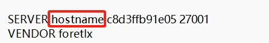
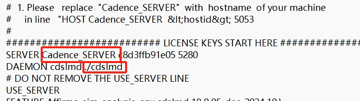
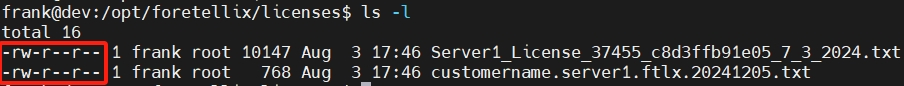
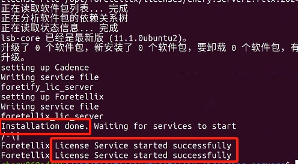
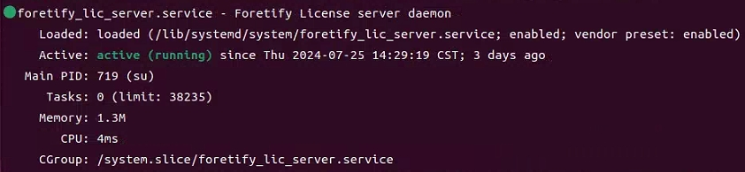
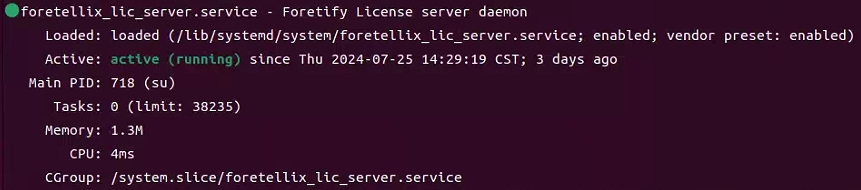
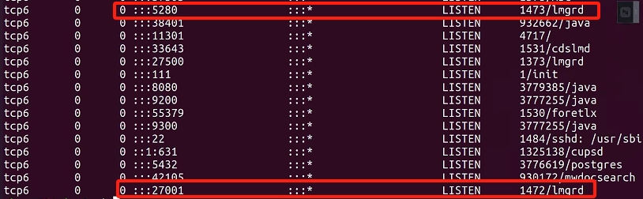
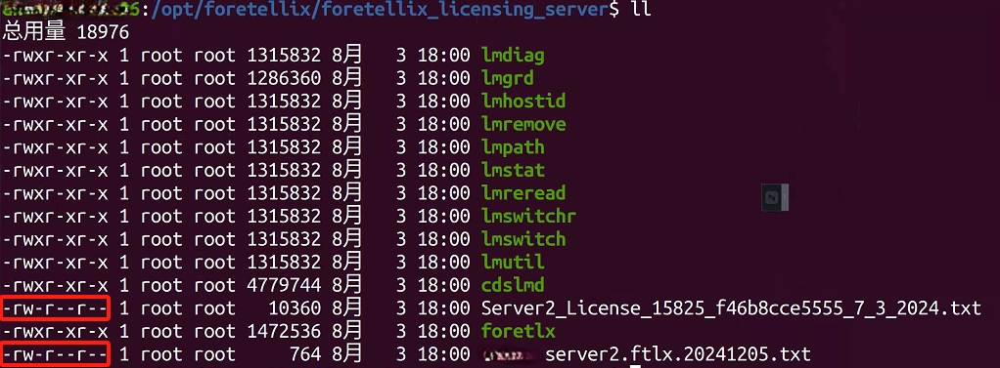

# 许可证安装

## 安装前准备

**1. 许可证文件**

Foretify许可证服务器的安装部署共需要两个license文件，请联系Foretellix工程师为指定工作站申请所需的许可证文件；

| 许可证文件 | 名称参考 | 
|---|---|
| **Foretellix license** | Server_license_xxxx.txt |
| **Foretify license** | *CUSTOMER*.server.fltx_xxxx.txt |

!!! note "注意"
    * 许可证文件与服务器的mac地址绑定，因此**许可证仅能在指定工作站上生效**
    * 许可证默认占用端口**5280**和**27001**，确保该两端口可用。

**2. 安装文件及安装脚本**
   
请联系Foretellix工程师提供许可证安装所需文件及脚本，一般以压缩包形式提供：

压缩包名称：**foretellix_licensing_servers.tar.gz**，解压后，内含：

  * 安装脚本：**license_installer.sh**
  * 安装文件：**installation_files**

---

这里假设上述所需文件位于您的`home`目录一个叫做`FORETELLIX_INSTALL`的文件夹下：

```yaml title="文件结构"
~/FORETELLIX_INSTALL/
├── foretellix_licensing_servers.tar.gz
└── licenses
    ├── Server_License_37455_c8d3ffb91e05_7_3_2024.txt
    └── customername.server1.ftlx.20241205.txt

```

---

## 安装步骤

**1. 安装依赖项**

如工作站已包含该依赖项，可跳过此步骤：
  
```sudo apt install -y lsb-core```

**2. 创建安装目录**

``` py
sudo mkdir -p /opt/foretellix
```  

!!! note "自定义安装目录"
    默认情况下Foretellix会选择`/opt/foretellix/`作为foretify软件的安装目录。用户也可以自行选择。
    但如果您自定义了其他安装目录，请**留意**后续的安装步骤中，需对出现默认安装目录`/opt/foretellix/`做**相应替换**。

**3. 将许可证文件和安装压缩包拷贝至安装目录**
   
```bash
cd ~/FORETELLIX_INSTALL
sudo cp foretellix_licensing_servers.tar.gz /opt/foretellix/
sudo cp -r licenses /opt/foretellix/
```

!!! tip "tip - 直接解压压缩包至安装目录"
    你也可选择直接将上述`tar.gz`压缩包解压至安装目录：
    ```bash
    sudo tar -xzvf foretellix_licensing_servers.tar.gz -C /opt/foretellix/
    ```
    > 选项`-C`表示目标目录
    > 执行该步骤，可跳过下一步操作。

**4. 解压压缩包至安装目录**

```bash
cd /opt/foretellix
tar -xzvf foretellix_licensing_servers.tar.gz
```
>解压后可通过`sudo rm foretellix_licensing_servers.tar.gz`将压缩包删除。

**5. 修改安装目录的ownership**

```bash
sudo chown -R $USER:users /opt/foretellix
```
> 选项`-R`是 "recursive" 的缩写，用于递归地更改目录及其所有子目录和文件的所有者。

**6. 根据工作站实际参数更新两个许可证文件**

<a id="许可证更新"></a>

需结合工作站实际情况将两个许可证文件中的部分占位符替换成工作站的实际参数值，如下所示：

=== "Foretify license"

    将foretify license中首行的`hostname`替换成工作站的实际hostname:

    <figure markdown="span">
    { width="500" }
    </figure>  


=== "Foretellix license"

    Foretellix license中有两处更新：

    1. 将`Cadence Server`替换成工作站的实际hostname
    2. 将`./cdslmd` 替换成 `cdslmd`所在的**绝对路径**
    >  `cdslmd` 位于解压后的`installation_files/`文件夹下。
    
    <figure markdown="span">
    { width="600" }
    </figure>  

**7. 更改两个license文件的权限**

<a id="更改两个license文件的权限"></a>

``` bash
cd /opt/foretellix/licenses
sudo chmod 644 *.txt
``` 

??? tip "tip - 可通过`ls -l`指令查看文件权限是否设置成功"

    <figure markdown="span">
    { width="800" }
    </figure>   

    **644权限**表示：

    - 所有者（user）: 读（r），写（w）
    - 群组（group）: 读（r）
    - 其他人（others）: 读（r）


**8. 运行许可证安装脚本**

<a id="运行许可安装脚本"></a>

``` bash
cd /opt/foretellix/foretellix_licensing_servers
sudo ./license_installer.sh -l <path_to_foretellix_license_file> -l <path_to_foretity_license_file> -i
/opt/foretellix/foretellix_license_server
```  
> 两个`-l`后需分别提供两个license的文件路径，例如`/opt/foretellix/licenses/Server_xxxx.txt`。两个license文件的顺序无所谓。

稍等片刻后，如果安装成功，您将看到类似如下输出；否则请参考下节[**问题排查**](#troubleshooting)进行排查或**直接联系Foretellix工程师予以协助**。

<figure markdown="span">
{ width="600" }
</figure>  

??? tip "运行脚本后的文件架构"

    运行脚本后，在安装目录下会自动创建一个新的文件夹`foretellix_license_server`。

    ```yml title="文件结构"
    /opt/foretellix/
    ├── foretellix_licensing_server
    ├── foretellix_licensing_servers
    └── licenses
    ```

???tip "关于license_installer.sh"

    ``` py
    -l | --license_file <path_to_file> The path to the license file to be set up. This option
    can be used more than once.
    -i | --install_dir <dir> The directory where to install the license servers
    -h | --help Show help (This page)
    ```

为确保license安装成功且运行，请通过下一步进行安装状态检查。 


## 安装状态检查

<a id="安装状态检查"></a>

通过如下脚本分别检测两项license服务的运行状态：

=== "Foretify license 状态"

    ```bash
    sudo systemctl status foretify_lic_server.service
    ```

    如果**foretify license**安装成功，您将看到类似如下输出：

    <figure markdown="span">
    { width="800" }
    </figure>  

=== "Foretellix license 状态"

    ```bash
    sudo systemctl status foretellix_lic_server.service
    ```

    如果**foretellix license**安装成功，您将看到类似如下输出：
    
    <figure markdown="span">
    { width="800" }
    </figure>  


同时，如果许可服务启动成功，您应该也可以看到5280和27001两个端口分别被进程lmgrd占用：

```bash title="查看端口占用"
sudo netstat -tnlp
```

<figure markdown="span">
{ width="800" }
</figure>  


至此，许可证服务器已安装完成。成功后您可以继续下一步：**Foretify软件的安装**。

## 问题排查

<a id="troubleshooting"></a>

如果上述第8步[运行许可安装脚本](#运行许可安装脚本)后未提示success，或上述第9步中查看到的license status不是`active`, 可从以下几方面入手进行问题排查：

**1. 检查两个license文件的权限是否设置正确**
   
详见上述步骤7-[更改两个license文件的权限](#更改两个license文件的权限)，需确保`/opt/foretellix/licenses`下的两个许可证文件的权限为**644**。

另外，在运行安装脚本后，在安装目录`opt/foretellix`下会自动生成一个新的文件夹`foretellix_licensing_server`，其中包含两份许可文件复制件。请检查并确保这两项许可文件的权限也为**644**：

<figure markdown="span">
{ width="600" }
</figure>  

如果权限不是644，请更改权限后再通过`sudo systemctl restart <service>`命令重启两项许可服务，操作如下：

```bash
cd /opt/foretellix/foretellix_licensing_server
sudo chmod 644 *.txt
sudo systemctl restart foretellix_lic_server.service
sudo systemctl restart foretify_lic_server.service
```

稍等片刻后，再重复上述[安装状态检查](#安装状态检查)，看是否解决问题。


**2. 检查许可证文件中的信息是否设置正确**

详见上述步骤6-[许可证更新](#许可证更新)。

**3. 检查5280及27001两个端口是否被其他进程占用**

**4. 查看log记录**

脚本运行后通常会有log记录，查看记录看是否存在error:
```py
gedit /var/log/foretellix/foretellix_lic_server.log
gedit /var/log/foretellix/foretify_lic_server.log
```

问题排查并修复后，可重复上述第8步-[运行许可安装脚本](#运行许可安装脚本)再次运行许可证安装脚本。
   
**5. 如果上述步骤均未能解决问题，不要犹豫，请联系Foretellix工程师进行协助调查！**
