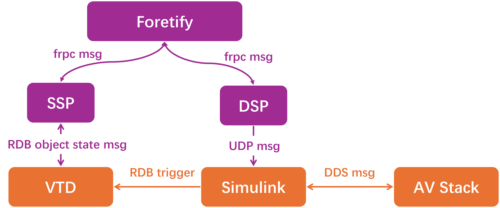
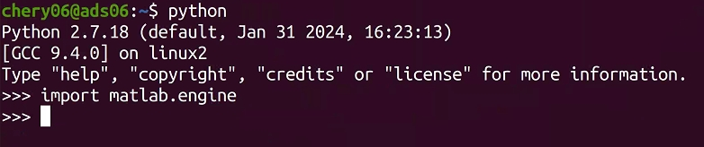

# 集成配置

!!! tip "本章提示"
    本章前半部分主要介绍关于集成的背景介绍，您可选择直接跳转至[配置步骤](#configuration-steps)进行实际操作。

## 关于集成

### 集成的作用

为了仿真测试以及评估SUT，Foretify需要设置并编排场景。在运行场景时，Foretify会向仿真器和被测对象SUT发送大量请求，主要用于:

- 编排场景
- 设置NPC和SUT的状态
- 收集各种状态和指标


### 集成的实现-SSP和DSP

Foretify 旨在尽可能保持通用性，以支持多种仿真器和被测系统（SUT）的配置。为了实现这一通用性，Foretellix定义了一套接口，分别实现foretfiy与simulator和SUT之间的集成：

| 集成 | 实现方式 | 说明 |
|---|---|---|
| **Foretify与simulator** | **SSP组件（标准）**|Foretify可无缝集成各种主流的仿真器软件，包括 VTD, Carmaker, Carla, 51Sim, Sumo等。但在正式使用之前，需要根据用户实际环境进行必要的配置，以确保Foretify可以连接到用户机上指定的仿真软件。|
| **Foretify与SUT** | **DSP组件（半定制）**|需根据用户提供的算法接口进行一定程度的定制开发。Foretellix 工程师将协助完成这部分工作。如用户希望自行集成新的算法，Foretellix 工程师将提供标准规范及培训，帮助用户工程师顺利完成算法集成。|

- **SSP-模拟器支持包** (Simulator Support Package): SSP是模拟器API的适配组件，提供接口给Foretify，接收Foretify的请求转化成对模拟器API的调用
- **DSP-被测对象支持包** (DUT Support Package):DSP是SUT API的适配组件，提供接口给Foretify，接收Foretify的请求转化成对SUT API的调用

---

### 集成架构

#### 一般集成架构

Foretify集成的一般架构如下所示：

<figure markdown="span">
  { width="800" }
  <figcaption>Foretify集成架构</figcaption>
</figure>

> 此图展现的是Foretify集成的一般架构。根据用户的实际测试架构的部署情况，上述架构可能需要相应调整。

其中各组件之间的关系抽象如下所示：

<figure markdown="span">
  { width="800" }
  <figcaption>Foretify集成的组件关系</figcaption>
</figure>


#### Chery集成架构

=== "Foretify集成后测试架构"

    <figure markdown="span">
      { width="600" }
      <figcaption>Foretify集成后setup</figcaption>
    </figure>

    * **DSP说明**：Chery DSP的主要功能是将OSC2.0文件中指定的NOA参数传入Simulink，并发送UDP消息触发Simulink发送RDB trigger。
    * **UDP通信说明**：DSP会发送UDP message到本机的12345端口。此端口由Simulink监听。
    ```C title="UDP message格式"
    struct udp_message {
    int sim_time;
    int speed;
    };
    ```
    >其中，sim_time表示当前触发的VTD模拟器时间。speed表示当前设置的NOA巡航速度。
    当foretify需要触发下一帧时，DSP就会发送这样一个UDP消息给Simulink。Simulink在接收到这个消息后会设置NOA速度并发送RDB trigger给VTD。


=== "原有测试架构（Foretify集成前）"

    <figure markdown="span">
      { width="600" }
      <figcaption>Foretify集成前用户setup</figcaption>
    </figure>

!!! note "注意"
    根据Chery实际测试架构的部署情况，接下来的集成配置步骤将包括针对Chery环境的特定配置。

---


## 配置步骤 <a id="configuration-steps"></a>


### 配置前准备

**1. 配置要求**

* VTD环境（本指南中**VTD的安装目录**为：~/VIRES/VTD.2023.1）
> 如安装目录或版本有所不同，以下配置过程中注意做相应替换。
* matlab 2022 环境
* 完成[许可证服务器安装](license_server_installation.md)
* 完成[Foretify安装](foretify_developer_installation.md)
* Python2.7环境（需安装Matlab engine for Python）

**2. 所需文件**

Foretellix工程师会提供如下文件：

| 所需文件 | 说明 | 
|---|---|
| **vtd_ssp** | ssp组件的二进制文件 |
| **vtd_dsp** | dsp组件的二进制文件 |
| **start_algo.sh** | 启动SUT算法的脚本（加入了启动simulink model的调用） |
| **stop_algo.sh** | 停止SUT算法的脚本（加入了停止simulink model的调用）|
| **start_slmdl.py** | 启动simulink model的脚本 （需Matlab engine for Python环境依赖） |
| **stop_slmdl.py** | 停止simulink model的脚本 （需Matlab engine for Python环境依赖） |
| **run_sl_mdl.sh** | 启动matlab |
| **start_Foretellix.m** | 加载simulink模型的m脚本 |
| **Simulink_VTD_noCarsim_0716_ftlx.slx** | simulink model(加入了与Foretify的通信模块)|


同样假设上述所需文件位于`home`目录下的`FORETELLIX_INSTALL`文件夹内。

### 配置步骤

**1. 将所需文件分别拷贝至正确的目录下**

为方便起见，需将一部分文件放在`~/Foretellix/`下，如果没有该文件夹，需执行指令创建：

```bash title="创建Foretellix文件夹"
cd
mkdir Foretellix
```

将上述各所需文件分别置于各自指定目录下：

| 所需文件 | 目标目录 | 
|---|---|
| **vtd_ssp** | **~/Foretellix/** |
| **vtd_dsp** | **~/Foretellix/** |
| **start_algo.sh** | **~/Foretellix/** |
| **stop_algo.sh** | **~/Foretellix/**|
| **start_slmdl.py** | **~/Foretellix/** |
| **stop_slmdl.py** | **~/Foretellix/** |
| **run_sl_mdl.sh** | **~/H-NOP/Lon/**  |
| **start_Foretellix.m** | **~/H-NOP/Lon/** |
| **Simulink_VTD_noCarsim_0716_ftlx.slx** | **~/H-NOP/Lon/**|

!!! note "硬编码路径 ~/H-NOP/Lon"
    注意：该路径在脚本`run_sl_mdl.sh`和`start_Foretellix.m`中均有引用，因此如果该路径发生变化，请做相应路径更新。

??? tip "~/Foretellix/文件"

    <figure markdown="span">
    { width="800" }
    <figcaption>Foretellix下所需脚本</figcaption>
    </figure>    

??? tip "~/H-NOP/Lon/ 文件"

    <figure markdown="span">
    { width="800" }
    <figcaption>~/H-NOP/Lon下所需的文件</figcaption>
    </figure>    
    > 注：此处不是全部文件，仅列举foretify集成所需文件。

**2. 添加环境变量至`ftx.rc`**

再次打开安装目录下的`ftx.rc`文件：

```bash
cd /opt/foretellix
gedit ftx.rc
```

在文末继续添加如下内容并保存：

```bash title="新增变量配置" hl_lines="2 3 4"
source $FTX/env/basic/exe_platforms/vtd_ssp/scripts/vtd.rc
export FTX_VTD_PROJ=SampleProject_zhongqi_0607
export FTX_VTD_HOME=~/VIRES/VTD.2023.1
export FTX_VTD_SETUP=zhongqi_HNOP_0607
export vtd=$FTX_VTD_SSP
export FTX_VTD_SSP_EXE=~/Foretellix/vtd_ssp
export FTX_VTD_DSP_EXE=~/Foretellix/vtd_dsp

export CHERY_START_EXE=echo
export CHERY_STOP_EXE=echo
export CHERY_START_EXE=~/Foretellix/start_algo.sh
export CHERY_STOP_EXE=~/Foretellix/stop_algo.sh
```
> 注：其中高亮的部分需根据实际环境进行配置。

至此，完整的`ftx.rc`文件应当如下所示：

??? tip "ftx.rc文件内容"
    ```bash hl_lines="1 11 14 24 25 26"
    export CDS_LIC_FILE=5280@127.0.0.1
    export INCISIVE_HOME=/opt/foretellix/XCELIUM1809
    export SPECMAN_PATH=${INCISIVE_HOME}/tools/bin
    export CDS_INST_DIR=${INCISIVE_HOME}
    export CDS_AUTO_64BIT=ALL
    export CDS_LIC_QUEUE_POLL=1
    export CDS_LIC_QUEUE_POLL_INT=10
    export PATH=$PATH:${INCISIVE_HOME}/bin:${INCISIVE_HOME}/tools/bin

    export FTX=/opt/foretellix/ftx
    export FTX_LIC_FILE=27001@127.0.0.1
    source $FTX/bin/ftx_setup.sh

    export PATH=$PATH:/opt/foretellix/fmanager_24.06.0.9_ubuntu2004/client/bin
    export FTX_FM_HOST=localhost
    export FTX_FMANAGER_PORT=8080
    export FTX_FMANAGER_HOST=localhost
    export FTX_FMANAGER_PORT=8080
    export FMANAGER_USER=admin@fmanager.com
    export FMANAGER_PWD=admin
    export FTX_FMANAGER_PROJECT=admin
    alias fmanager='google-chrome http://${FTX_FMANAGER_HOST}:${FTX_FMANAGER_PORT}'

    export FTX_VTD_PROJ=SampleProject_zhongqi_0607
    export FTX_VTD_HOME=~/VIRES/VTD.2023.1
    export FTX_VTD_SETUP=zhongqi_HNOP_0607
    source $FTX/env/basic/exe_platforms/vtd_ssp/scripts/vtd.rc
    export vtd=$FTX_VTD_SSP
    export FTX_VTD_SSP_EXE=~/Foretellix/vtd_ssp
    export FTX_VTD_DSP_EXE=~/Foretellix/vtd_dsp

    export CHERY_START_EXE=echo
    export CHERY_STOP_EXE=echo
    export CHERY_START_EXE=~/Foretellix/start_algo.sh
    export CHERY_STOP_EXE=~/Foretellix/stop_algo.sh
    ```

    > 注：上述语句的顺序不能随意变换，因为前后之间可能有依赖关系。比如引用了`$FTX` 的语句需出现在`export FTX` 语句之后。

**3. 配置`~/.bashrc`**

添加如下语句至`~/.bashrc`：

```bash
export PATH=~/MATLAB/R2022a/bin:$PATH
source /opt/foretellix/ftx.rc #如已添加则略过
```
> 注意：第一行引用了Matlab的安装路径，如有变化请注意替换。

运行`source ~/.bashrc`或新打开一个Terminal使其生效。

**4. 安装 MATLAB Engine for Python**

首先安装Ptyhon2.7的开发包：

```bash
sudo apt update
sudo apt install python2.7-dev
```

然后安装Matlab Engine for Python:

```bash
cd ~/MATLAB/R2022a/extern/engines/python
sudo python setup.py install
```

安装完成后，可在Terminal中进行验证:

```bash
python
import matlab.engine
```

如果没有报错，则安装成功。

<figure markdown="span">
{ width="600" }
<figcaption>验证安装Matlab Engine for Python</figcaption>
</figure>    


**5. 修改vtd_config.osc文件**

为了适配Chery环境中的VTD，还需对foretify安装目录下的`vtd_config.osc`文件执行如下配置修改。

打开配置文件：

```bash
cd $FTX/env/basic/exe_platforms/vtd_ssp/config
gedit vtd_config.osc
```

- 将源文件中第34行的`rdb_trigger_policy = ALL`改成`rdb_trigger_policy = FIRST_ONLY`
- 在第35行加入`set connection_string = "127.0.0.1:48179;127.0.0.1:48690"`

更新后保存。

??? note "更新后的`vtd_config.osc`"
    ```bash hl_lines="9 10"
    extend sim_config:
        set resolution = "1280x720"
        set tl_api_level = physical
        set requires_speed_and_acceleration_for_kinematic_move = true

        const camera_view: vtd_default_view
        set camera_view = rear
        const rdb_trigger_policy: rdb_trigger_policy
        set rdb_trigger_policy = FIRST_ONLY
        set connection_string = "127.0.0.1:48179;127.0.0.1:48690"

    extend sim_info:
        set simulator_name = "vtd"
    ```
    > **注：**此处未显示全部代码，高亮标记需修改行。

**6. 修改vtd_config_imp.osc文件**

打开`vtd_config_imp.osc`文件：

```bash
cd $FTX/env/basic/exe_platforms/vtd_ssp/config
gedit vtd_config_imp.osc
```

如果您使用的foretify版本为24.06或更低版本，请将源文件中的第19和20行中出现的`append`改成`add`。

更新后保存。

??? note "更新后的`vtd_config.osc`"
    ```bash hl_lines="4 5"
    extend av_sim_adapter:
        def get_ssp_launch_args(connection_string: string)-> list of string is only:
            var vtd_dsp_cmd_args := strings.split(os.getenv("FTX_VTD_SSP_EXE"), " ")
            vtd_dsp_cmd_args.add("--address")
            vtd_dsp_cmd_args.add(connection_string)
    ```
    > **注：**此处未显示全部代码，高亮标记需修改行。


至此，集成配置已经完成。请进行下一步[快速开始](../quick_start/quick_start.md)。

    