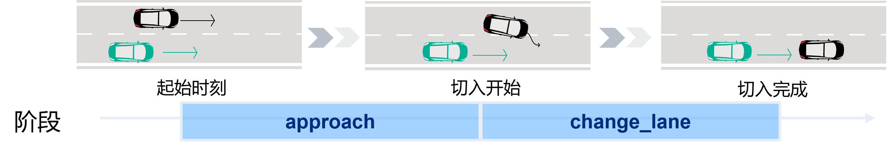
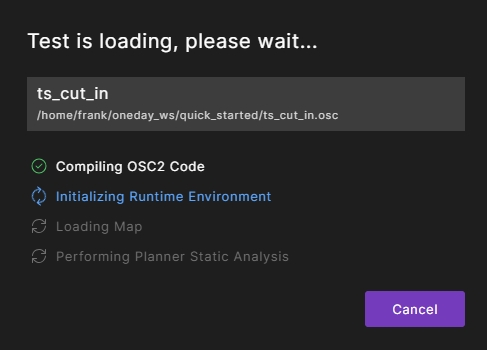
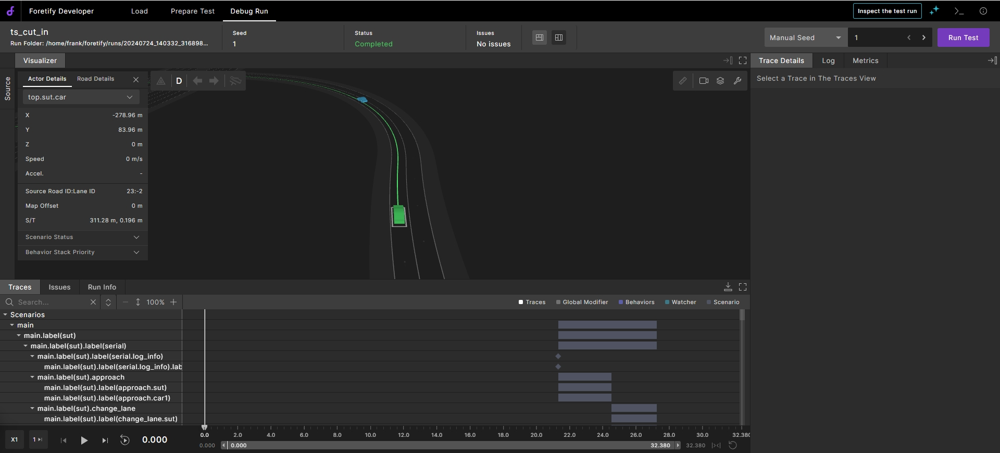

# 快速开始

本节我们通过一个简单的`cut_in`案例带您快速体验如何通过Foretify Developer完成一次基于抽象场景的测试。

## 查看场景描述

Foretellix提供的V-Suites可看作V&V起步包，其中包含了大量丰富的预定义抽象场景。工程师可以直接从中选取场景进行参考。我们可以直接从中选取所需的`cut_in`场景。

!!! tip "关于V-Suites"
    - V-Suites中不但包含了大量的预定义的抽象场景，还包含了预定义的评价指标、覆盖度指标等。本指南对V-Suites暂不做展开介绍。
  

但为便于初学者理解，我们对该场景进行了一定程度的简化。如下图所示，展示了该场景包含的两个阶段。

<figure markdown="span">
  { width="600" }
  <figcaption>cut_in场景的阶段定义</figcaption>
</figure>

!!! note "注意"
    - **用户暂且无需关心代码实现部分**，后续会通过正式Workshop向用户讲解。

场景OSC2.0的代码如下所示：

??? note "cut_in抽象场景代码的OSC2.0实现"

    ``` py
    # Copyright (c) 2019-2023 Foretellix Ltd. All Rights Reserved.
    # ----------------------------------------------------------------------------
    # sut::cut_in
    # In this scenario, car1 tries to cut in front of the SUT, with lower speed than the SUT

    scenario sut.cut_in:
        car1: vehicle  # The "cut-in" car
        side: av_side  # The side of which car1 cuts in, left or right

        do serial():

            log_info ("The cut in is happening from the $(side) side")

            approach: parallel(duration:[3..5]second, overlap:equal):
                sut.car.drive() with:
                    sut_speed: speed([30..]kph, at: start)
                    keep_lane(run_mode: best_effort)
                car1.drive() with:
                    l1: lane(side_of: sut.car, side: side)
                    p1: position(distance: [10..20]meter, at: start, ahead_of: sut.car, measure_by: nearest)                
                    p2: position(distance: [10..20]meter, at: end, ahead_of: sut.car, measure_by: nearest, run_mode: best_effort)                
            change_lane: parallel(duration:[1..3]second, overlap:equal):
                sut.car.drive() with:
                    keep_lane(run_mode: best_effort)
                car1.drive() with:
                    s1: speed(speed: [5..15]kph, slower_than: sut.car, at: start, run_mode: best_effort)
                    l2: lane(same_as: sut.car, at: end)
                    avoid_collisions(false)    
    ```

用户可将上述代码复制并创建一个.osc文件，命名为`cut_in.osc`。

 **注意：**此文件只是一个动态场景的定义文件，若需要执行测试，还需要配置仿真器、地图等必要元素，因此还需要创建一个测试定义文件。

## 创建测试定义文件

一个典型的测试定义文件通常包含场景定义、地图配置、仿真器配置、评价指标配置等。为简单起见，我们暂且仅定义地图和仿真器配置。
在与场景定义文件`cut_in.osc`的同级目录下，我们创建一个测试定义文件，命名为`ts_cut_in.osc`。代码如下：

??? note "测试定义的OSC2.0代码实现"

    ``` py
    # Copyright (c) 2019-2023 Foretellix Ltd. All Rights Reserved.

    import "$FTX/env/basic/exe_platforms/model_ssp/config/model_sumo_config.osc" # 导入仿真器配置
    import "cut_in.osc" # 导入场景

    extend test_config:
        set map = "$FTX_PACKAGES/maps/Town04.xodr" # 设置地图

    extend top.main:
        do sut.cut_in() # 调用场景
    ```

!!! note "注意"
    - 本例中我们采用Foretify内置的简易模拟器`sumo_model`.运行过程中并不会调用实际仿真界面，但是可以在Foretify UI中看到仿真效果的回放。

## 使用Foretify执行测试

### 执行单次测试

**1. 加载测试文件**

在测试定义文件`ts_cut_in.osc`所在的目录下启动`Terminal`，执行以下命令将测试文件加载到Foretify中。

``` title="Foretify命令: foretify调用"
foretify --load ts1_cut_in_and_slow.osc --gui
```

Foretify GUI会在浏览器的新标签中打开并开始编译。

<figure markdown="span">
{ width="300" }
<figcaption>测试编译</figcaption>
</figure>

Foretify会编译测试，初始化运行环境，加载地图，并执行规划器静态分析。如果文件中有拼写错误，您将看到编译错误。如果需要，在单独的窗口中编辑测试文件，然后单击状态栏中的重新加载按钮。


**2. 启动运行**

在右上角，单击`Run Test`按钮。

运行过程中，您将注意到`status`的变化，如果在测试文件中我们将仿真器配置为实际的仿真器，则该过程中您将注意到仿真器窗口自动打开，运行执行。当运行完成时，仿真窗口关闭，结果报告在状态栏中显示。

运行完成后，您可以在Foretify Developer的界面上观察场景回放，查询相关数据记录等。

<figure markdown="span">
{ width="800" }
<figcaption>Run completed</figcaption>
</figure>

**3. 更换`seed`运行**

在右上角更换一个`seed`(任意正整数)， 并再次单击`Run Test`按钮。
运行结束后，您将会注意到此次Foretify生成了一个全新的`cut_in`场景。

**4. 退出Foretify**
   
要退出Foretify，可直接关闭浏览器标签，或在执行Foretify调用命令的Terminal中执行`Ctrl+C`。


### 执行多次测试

通过Foretify Developer，我们可以基于该场景进行连续的测试生成，如上述实验观察到的，每一次新生成的测试都是不同的具体场景，而每个具体场景都有唯一的一个`seed`作为标识。

同样地，在测试定义文件`ts_cut_in.osc`所在的目录下启动`Terminal`，通过`--crun` 指令执行启动连续测试。

```bash title="Foretify命令: foretify调用执行多次连续测试"
foretify --load ts1_cut_in_and_slow.osc --gui --crun 5
```

!!! tip "小提示"
    通过`foretify --help`可查看foretify还支持哪些指令功能。本指南不做展开叙述。


!!! note "注意"
    通过`--crun`指令，我们可以基于单个案例实现快速的连续泛化测试。但这并非真正意义上的大规模泛化测试。在正式的Workshop中您将会了解到如果通过测试组的定义实现多场景、可控参数的规模泛化。