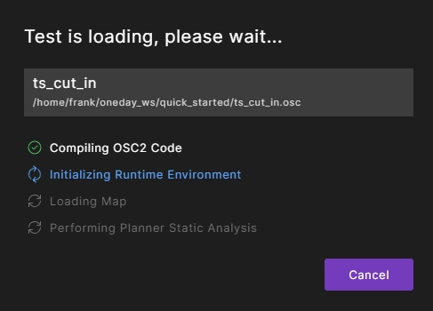

# 抽象场景的测试

## 查看场景描述

此文档以*cut_in_and_slow*场景为例，如下图所示，展示了该场景的各个阶段。

<figure markdown="span">
  { width="200" }
  <figcaption>cut_in场景的阶段定义</figcaption>
</figure>

!!! note "注意事项"
    - 本文档暂不包含关于V-Suites中各场景的详细描述。
    - 为便于初学用户学习，本指南中暂不采用V-Suites中提供的场景文件。
    - **用户暂且无需关心代码实现部分**，后续会通过正式Workshop向用户讲解。

场景OSC2.0的代码如下所示：

??? note "cut_in 抽象场景的OSC2.0代码实现"
    ``` py
    # Copyright (c) 2019-2023 Foretellix Ltd. All Rights Reserved.
    # ----------------------------------------------------------------------------
    # sut::cut_in
    # In this scenario, car1 tries to cut in front of the SUT, with lower speed than the SUT

    scenario sut.cut_in:
        car1: vehicle  # The "cut-in" car
        side: av_side  # The side of which car1 cuts in, left or right

        do serial():

            log_info ("The cut in is happening from the $(side) side")

            approach: parallel(duration:[3..5]second, overlap:equal):
                sut.car.drive() with:
                    sut_speed: speed([30..]kph, at: start)
                    keep_lane(run_mode: best_effort)
                car1.drive() with:
                    l1: lane(side_of: sut.car, side: side)
                    p1: position(distance: [10..20]meter, at: start, ahead_of: sut.car, measure_by: nearest)                
                    p2: position(distance: [10..20]meter, at: end, ahead_of: sut.car, measure_by: nearest, run_mode: best_effort)                
            change_lane: parallel(duration:[1..3]second, overlap:equal):
                sut.car.drive() with:
                    keep_lane(run_mode: best_effort)
                car1.drive() with:
                    s1: speed(speed: [5..15]kph, slower_than: sut.car, at: start, run_mode: best_effort)
                    l2: lane(same_as: sut.car, at: end)
                    avoid_collisions(false)    
    ```

用户可将上述代码复制并创建一个.osc文件，命名为`cut_in.osc`. 注意：此文件只是一个动态场景的定义文件，若需要执行测试，还需要配置仿真器、地图等必要元素，因此还需要创建一个测试定义文件。

## 创建测试定义文件

一个典型的测试定义文件通常包含场景定义、地图配置、仿真器配置、评价指标配置等。为简单起见，我们暂且仅定义地图和仿真器配置。
在与场景定义文件`cut_in.osc`的同级目录下，我们创建一个测试定义文件，命名为`ts_cut_in.osc`。代码如下：

??? note "cut_in场景测试定义的OSC2.0代码实现"

    ``` py
    # Copyright (c) 2019-2023 Foretellix Ltd. All Rights Reserved.

    import "$FTX/env/basic/exe_platforms/model_ssp/config/model_sumo_config.osc" # 导入仿真器配置
    import "cut_in.osc" # 导入场景

    extend test_config:
        set map = "$FTX_PACKAGES/maps/Town04.xodr" # 设置地图

    extend top.main:
        do sut.cut_in() # 调用场景
    ```

!!! note "注意"
    - 本例中我们采用Foretify内置的简易模拟器`sumo_model`.运行过程中并不会调用实际仿真界面，但是可以在Foretify UI中看到仿真效果的回放。

## 使用Foretify执行测试。

### 执行单次测试

1. 在测试定义文件`ts_cut_in.osc`所在的目录下启动`Terminal`，执行以下命令将测试文件加载到Foretify中。

    ```bash title="Foretify命令: foretify调用"
    bash: foretify --load ts1_cut_in_and_slow.osc --gui
    ```

    Foretify GUI会在浏览器的新标签中打开并开始编译。

    <figure markdown="span">
    { width="300" }
    <figcaption>测试编译</figcaption>
    </figure>


    Foretify会编译测试，初始化运行环境，加载地图，并执行规划器静态分析。

    如果文件中有拼写错误，您将看到编译错误。

    如果需要，在单独的窗口中编辑测试文件，然后单击状态栏中的重新加载按钮。

    <figure markdown="span">
    { width="300" }
    <figcaption>reload</figcaption>
    </figure>

2. 在右上角，单击`Run Test`按钮。

   运行过程中，您将注意到`status`的变化，如果在测试文件中我们将仿真器配置为实际的仿真器，则该过程中您将注意到仿真器窗口自动打开，运行执行。当运行完成时，仿真窗口关闭，结果报告在状态栏中显示。

   运行完成后，您可以在Foretify Developer的界面上观察场景回放，查询相关数据记录等。

    <figure markdown="span">
    { width="300" }
    <figcaption>Run completed</figcaption>
    </figure>

3. 在右上角更换一个`seed`(任意正整数)， 并再次单击`Run Test`按钮。
   运行结束后，您将会注意到此次Foretify生成了一个全新的`cut_in`场景。


4. 要退出Foretify，关闭浏览器标签。或在执行Foretify调用命令的Terminal中执行`Ctrl+C`。

5. 要查看此次运行生成的数据，请打开~/foretify/runs/&lt;timestamp>目录。


### 执行多次测试

   在测试定义文件`ts_cut_in.osc`所在的目录下启动`Terminal`，执行以下命令将测试文件加载到Foretify中。

    ```bash title="Foretify命令: foretify调用"
    bash: foretify --load ts1_cut_in_and_slow.osc --gui
    ```

