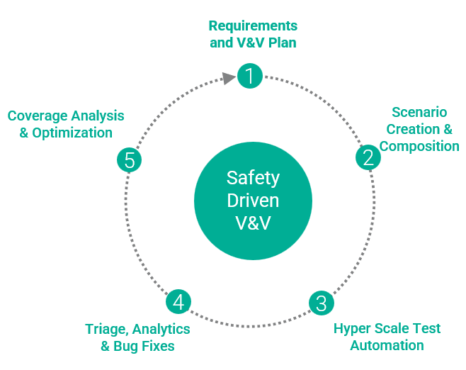
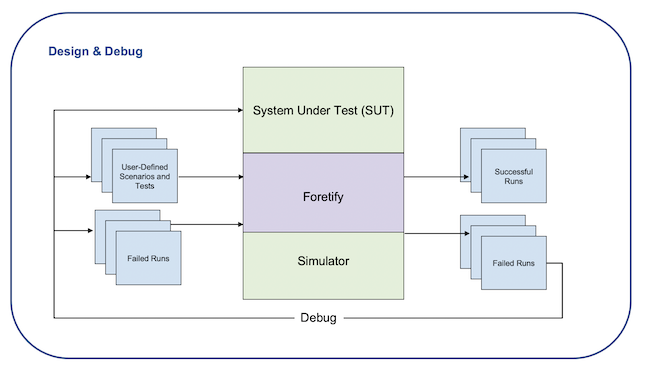
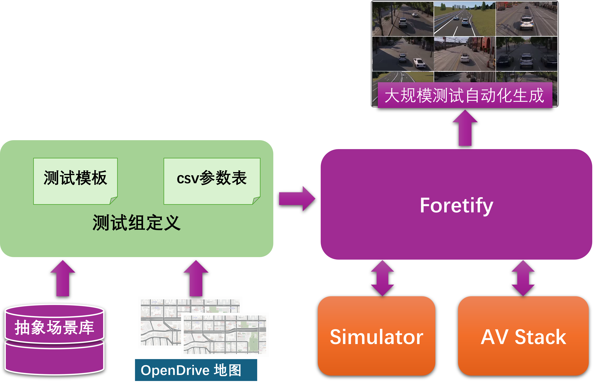
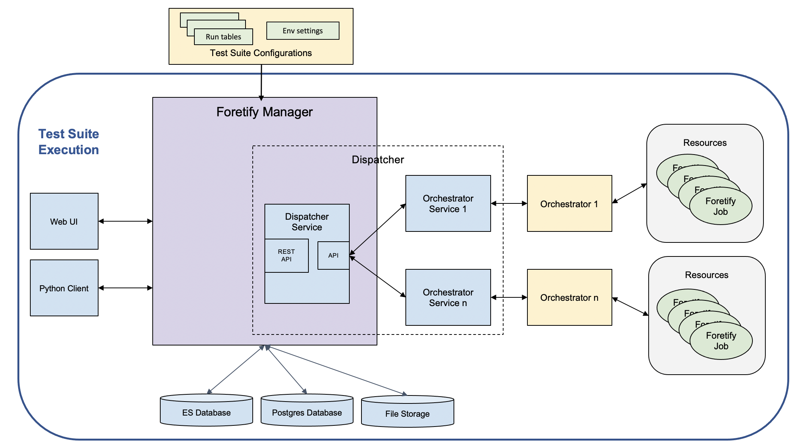
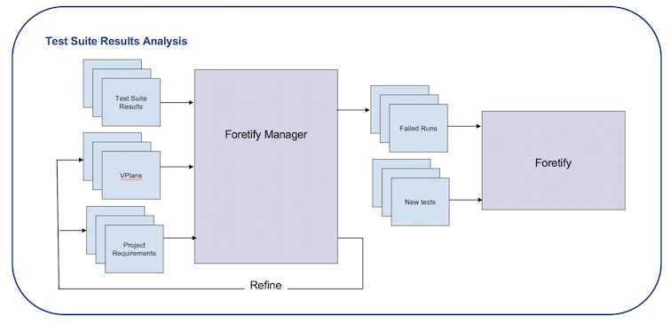

# 基于Foretellix的测试和验证环境介绍

为了验证高级驾驶辅助系统（ADAS）或自动驾驶（AD）功能的安全性，需要观察被测试系统（SUT）在各种情况或*场景*下的表现。

Foretellix的验证和验证（V&V）环境与V-Suites库一起使用，帮助您验证常见的ADAS和AD功能及标准，包括但不限于：

- 速度辅助系统（SAS）
- 自动紧急制动（AEB）
- 车道支持系统（LSS）
- L4级高速公路
- EuroNCAP

V-Suites包含测试ADAS或AD功能所需的所有组件，包括场景、测试、地图、测试组定义（CSV文件）和验证计划（VPlans）。

## 基于安全驱动的V&V自动化流程和引擎

Foretellix V&V环境的自动化流程和引擎实施了一个基于V-Suites组件的安全驱动验证（Safety-Driven Verification, SDV）过程，从而生成大量基于测试的测试案例。

<figure markdown="span">
  { width="400" }
  <figcaption>SDV工作流程</figcaption>
</figure>

SDV的四大支柱包括：

- **抽象场景：** V-Suites场景是抽象的高层次描述，定义了场景中的挑战性规则。这些场景使用OSC2进行定义，即OpenSCENARIO2.0 ASAM标准。

- **自动化测试创建：** V-Suites测试是参数化的，这意味着可以控制场景的关键属性或参数（如车辆速度或执行动作的时间），从而控制场景的泛化方向。

- **“约束-随机”大规模测试自动化生成：** 每次测试运行时，Foretellix的“约束-随机”求解器使用您指定的约束，在各种组合中测试SUT，以您可能未曾预见的方式执行测试。

- **测试结果评估：** Foretellix Manager汇总测试过程中收集的度量数据，并将其映射到VPlans上 - 这是机器可读的验证计划，帮助您分析度量数据和测试结果。通过Foretellix Manager，您可以分析验证进度，并基于客观自动生成的度量数据做出决策。

Foretellix自动流程的三个阶段包括：

- 设计和调试
- 测试组执行(泛化)
- 结果分析

### 设计和调试

如图1所示，**Foretellix** 是一个引擎，帮助您设计和调试单个场景和测试。您可以直接使用V-Suites的场景和测试，也可以根据项目需求进行修改。此外，您还可以创建自己的场景和测试。

<figure markdown="span">
  { width="600" }
  <figcaption>设计和调试</figcaption>
</figure>

Foretellix 提供了各种视图，帮助您进行场景的设计和调试。例如，可视化工具允许您查看选定地图上的测试计划或实际执行情况。基于时间的视图（如可视化工具）与通用时间线相连接，您可以在时间轴上同步这些视图，向前或向后移动。

### 测试组执行

测试组 `test_suites` 是用于规模化测试的参数定义文件，主要包含测试定义模板 `templates` 和 CSV 参数表 `csv` 两部分。

基于测试组的测试自动化泛化生成的基本流程如下图所示：

<figure markdown="span">
  { width="600" }
  <figcaption>测试自动化泛化生成</figcaption>
</figure>

对于多节点高并发的云端大规模测试，您可以通过向 Foretellix Manager 提交以 CSV 格式定义的测试组及各种环境设置来启动测试。Foretellix Manager 调用 Dispatcher 将任务提交至 Foretellix，在多个节点上同时执行。

<figure markdown="span">
  { width="600" }
  <figcaption>测试组的高并发执行</figcaption>
</figure>

!!! tip "Foretellix Manager的角色"
    Foretellix Manager 不仅具备测试数据的分析统计功能，而且还负责基于测试组规模的调度和执行。

### 结果分析

如图所示，**Foretellix Manager** 在分析测试组执行的汇总指标方面发挥了关键作用。如果您已将需求管理工具（如 MagicDraw 或 IBM DOORS）集成到 Foretellix Manager 中，您可以将 VPlan 中的指标与特定项目需求进行关联。

<figure markdown="span">
  { width="600" }
  <figcaption>结果分析</figcaption>
</figure>

Foretellix Manager 还是故障分析的中心，帮助您识别 SUT 的错误以及场景或模拟器的问题。相同类型的问题被分组在一起，便于您快速识别测试组中的常见问题。

## V&V任务流程

在执行正式测试之前，您需要集成和配置 Foretellix 和 SUT。这些任务在[集成说明](../Integration/Integration.md)中进行了详细描述。不过，在 SUT 和执行平台集成之前，您可以使用 Foretellix 内置的简易 SUT 和 sumo_model_ssp（基于 SUMO 的简易模拟器，主要用于快速场景调试）来运行测试组。

根据SDV流程，完整的V&V任务应包括：

1. 根据需求制定测试计划
2. 抽象场景的复用或创建
3. 基于抽象场景的测试定义及场景调试
4. 测试组定义及场景的自动化泛化
5. 测试结果分析（问题分诊、覆盖度和性能指标分析）

本 *入门指南* 将通过一个简单的`cut_in`示例带您体验如何通过Foretify Developer进行场景的调试。

!!! note "注意"
    - 该 "入门指南" 仅对产品功能做基本的介绍，更多详细功能及应用需在经过Workshop培训后提供；
    - 阅读该“入门指南”过程中，用户不必在意OSC2.0语言的实现，Foretellix工程师会通过正式Workshop进行讲解培训。

!!! note "注意"
    - Foretellix 提供了一整套测试和验证解决方案和流程，包括 V&V 进展和覆盖率的测量，这些指标展示了对验证计划的覆盖范围和测试进展情况。该工具本身无法自动保证达到全面安全性和可靠性所需的 100% 覆盖范围，除非这些保证标准在验证计划中明确指定。
    - Foretellix 软件使用开源软件，并具有第三方工具许可。

